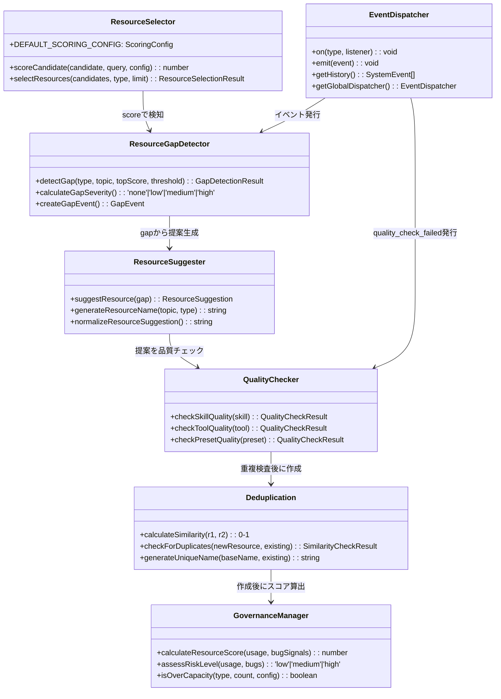
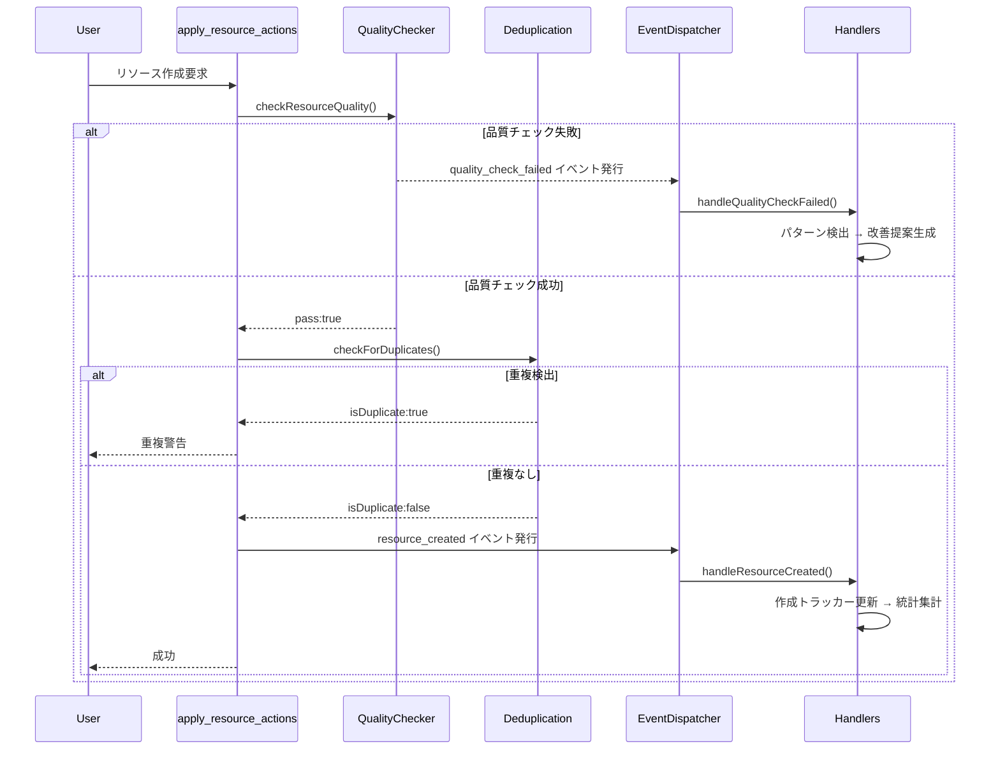
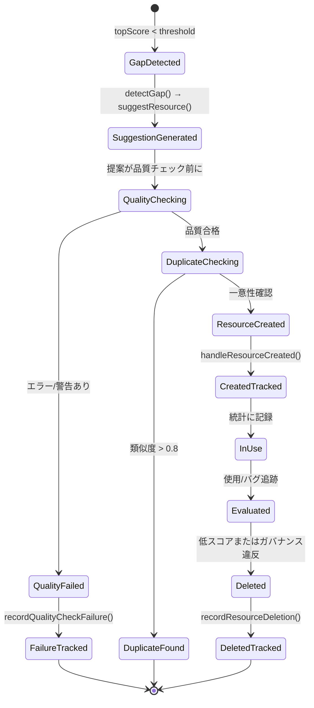
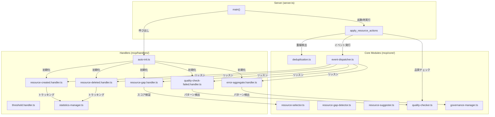
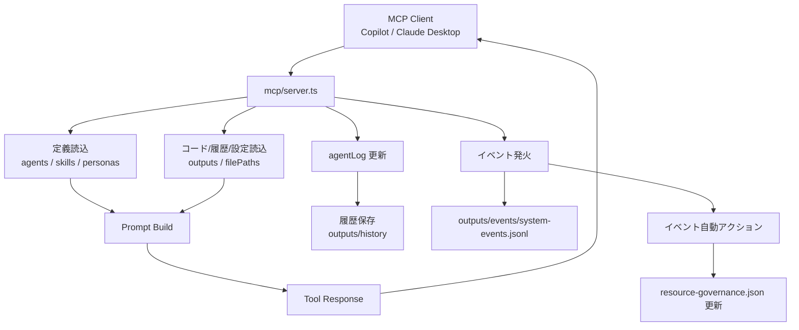
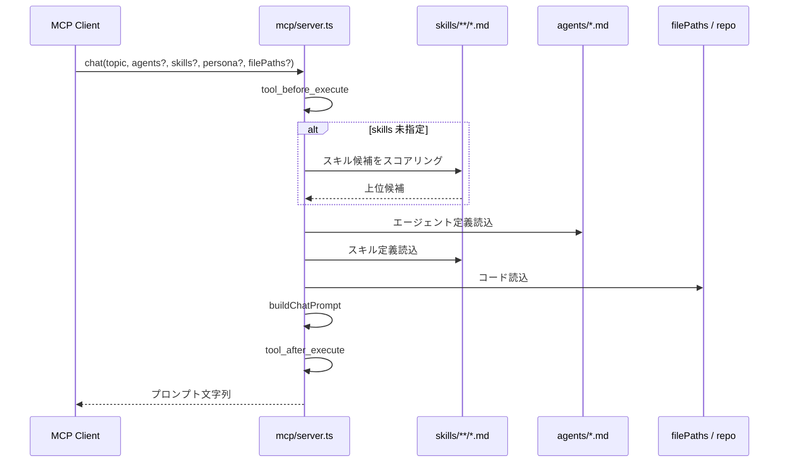
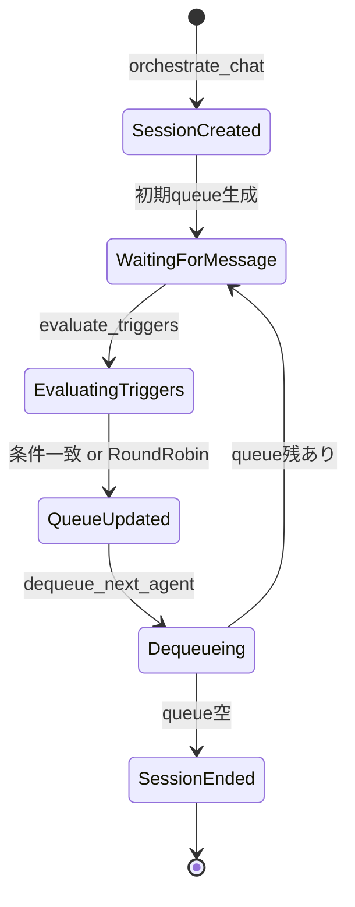
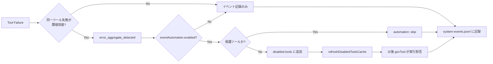
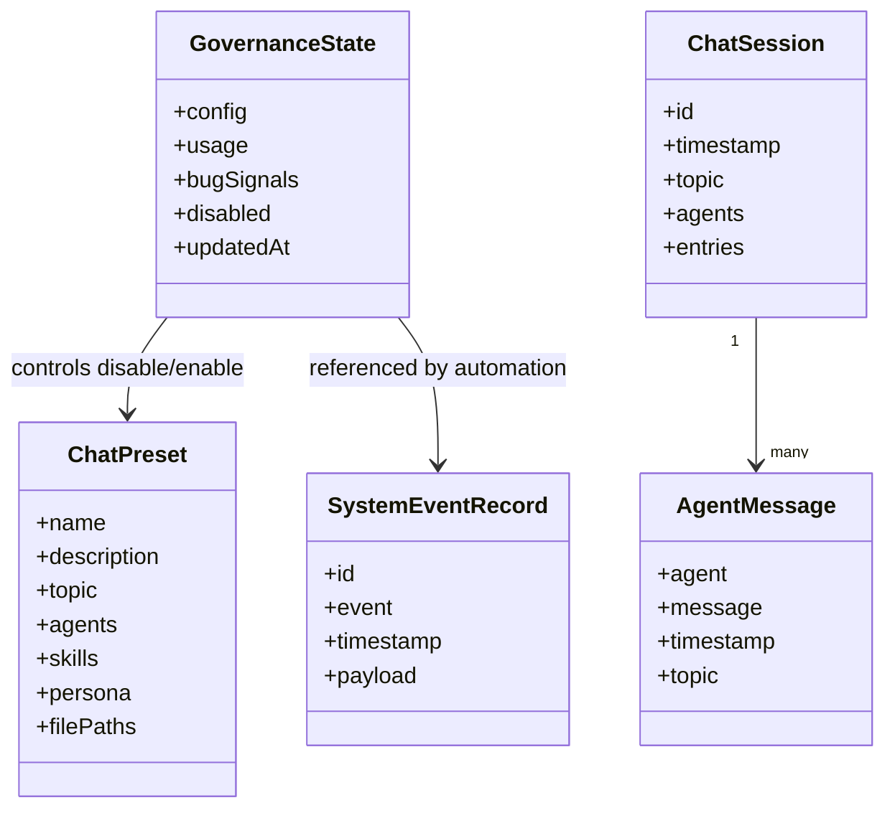

# Salesforce AI Company - 5-Phase Evolution Architecture

## 📋 Overview

**Salesforce AI Company** は、MCP サーバーとして Salesforce 開発を支援する AI エージェント・スキル・ツールを**動的に選択・補完・拡張する**システムです。

### 5-Phase Evolution

```
┌─────────────────────────────────────────────────────────────────┐
│  Phase 1: リソース選択の高度化 (Resource Scoring)              │
│  → 検索クエリに基づく実装されたスコアリングアルゴリズム      │
│  → DEFAULT_SCORING_CONFIG に定義された数式による正確な選定    │
└─────────────────────────────────────────────────────────────────┘
                ↓
┌─────────────────────────────────────────────────────────────────┐
│  Phase 2: リソース不足の検知と補完 (Gap Detection & Suggestion)│
│  → トップスコアと閾値の比較によるギャップ検出                │
│  → severity 分類 (none/low/medium/high)                         │
│  → リソース提案の自動生成                                      │
└─────────────────────────────────────────────────────────────────┘
                ↓
┌─────────────────────────────────────────────────────────────────┐
│  Phase 3: イベント駆動による自動拡張 (Quality & Deduplication)│
│  → 品質チェック (Skills/Tools/Presets の3つプロファイル)     │
│  → 重複検出 (Levenshtein距離による類似度判定)                │
│  → apply_resource_actions へ統合                               │
└─────────────────────────────────────────────────────────────────┘
                ↓
┌─────────────────────────────────────────────────────────────────┐
│  Phase 4: 安全な自己進化 (Event-Driven Handlers)              │
│  → 6つのハンドラーが6つのイベント型に反応                    │
│  → イベント履歴管理とエラーパターン検出                      │
│  → 統計管理による全体的な可視化                                │
└─────────────────────────────────────────────────────────────────┘
                ↓
┌─────────────────────────────────────────────────────────────────┐
│  Phase 5: 責務分離と自動実行 (Handlers Auto-Initialization)   │
│  → server.ts 起動時に全ハンドラーを自動登録                  │
│  → イベント駆動による自動実行                                  │
│  → 人的介入なしで自己進化を継続                                │
└─────────────────────────────────────────────────────────────────┘
```

---

## 🏗️ Architecture

### Class Diagram: Core Modules



### Sequence Diagram: Event Flow



### State Diagram: Resource Lifecycle



### Component Diagram: Modular Separation



---

## 📦 Module Reference

### Phase 1: Resource Selector

**File**: mcp/core/resource/resource-selector.ts

| Interface | Purpose |
|-----------|---------|
| `ResourceCandidate` | スコアリング対象のリソース |
| `ScoringConfig` | スコアリング係数の設定 |
| `ResourceSelectionResult` | 選定結果（selected[]、isGap） |

**Scoring Formula**:
```
score = nameMatch + tagMatch + descriptionMatch + usageScore 
     - (bugPenalty) + recencyBonus
```

**Example Usage**:
```typescript
const score = scoreCandidate(skill, "apex testing");
const result = selectResources(candidates, "skills", 3);
if (result.isGap) {
  // トップスコア < 5 のときギャップ検出
}
```

---

### Phase 2: Resource Gap Detection

**File**: mcp/core/resource/resource-gap-detector.ts

| Method | Input | Output |
|--------|-------|--------|
| `detectGap()` | type, topic, topScore, threshold=5 | GapDetectionResult |
| `calculateGapSeverity()` | ratio = topScore/threshold | "none" \| "low" \| "medium" \| "high" |
| `createGapEvent()` | GapDetectionResult | GapEvent \| null |

**Severity Mapping**:
- **none**: topScore ≥ threshold
- **low**: 0.75 ≤ ratio < 1.0
- **medium**: 0.5 ≤ ratio < 0.75
- **high**: ratio < 0.5

---

### Phase 3: Quality & Deduplication

#### Quality Checker
**File**: mcp/core/quality/quality-checker.ts

**Quality Profiles**:

| Type | Requirements | Score Impact |
|------|-------------|--------------|
| **Skill** | tags ≥ 2, summary ≥ 10 chars | nameMatch: 50%, tags: 30%, content: 20% |
| **Tool** | description ≥ 10 chars | description: 100% |
| **Preset** | agents ≥ 1, name 2-100 chars | structure: 100% |

#### Deduplication
**File**: mcp/core/quality/deduplication.ts

| Method | Purpose |
|--------|---------|
| `calculateSimilarity()` | Levenshtein距離 + コンテンツ比較 → 0-1 |
| `checkForDuplicates()` | threshold = 0.8 で類似リソース検出 |
| `generateUniqueName()` | 既存名と競合しない一意の名前を生成 |

---

### Phase 4: Handlers

**Directory**: mcp/handlers/

| Handler | Event | Purpose |
|---------|-------|---------|
| resource-gap.handler.ts | `resource_gap_detected` | ギャップ検出時に提案を自動生成 |
| resource-created.handler.ts | `resource_created` | 作成リソースを追跡・カウント |
| resource-deleted.handler.ts | `resource_deleted` | 削除パターンを追跡 |
| error-aggregate.handler.ts | `error_aggregate_detected` | エラー集約を検出 → 自動無効化 |
| quality-check-failed.handler.ts | `quality_check_failed` | 品質失敗パターンから改善提案 |
| threshold.handler.ts | `governance_threshold_exceeded` | キャパシティ超過時の自動クリーンアップ |

**Statistics Manager**: 全ハンドラーの統計を集約 → CSV/JSON エクスポート

---

### Phase 5: Handlers Auto-Initialization

**File**: mcp/handlers/auto-init.ts

```typescript
// server.ts の main() で自動実行
const handlersState = initializeHandlersState();
autoInitializeHandlers(handlersState);
```

| Function | Effect |
|----------|--------|
| `initializeHandlersState()` | 4つのハンドラートラッカーを初期化 |
| `autoInitializeHandlers()` | 6つのイベント型に全ハンドラーを登録 |
| `generateHandlersDashboard()` | 統計情報をダッシュボード形式で返す |

---

## 🧪 Testing

### Test Files

```bash
# Core module tests
npm test -- tests/core-modules.test.ts

# Handler tests
npm test -- tests/handlers-modules.test.ts

# Quality & duplicate tests
npm test -- tests/apply-resource-actions.test.ts

# すべてのテスト実行
npm test
```

### Test Coverage

- ✅ Resource Selector (scoring, selection, gap detection)
- ✅ Gap Detector (high/low gap, event creation)
- ✅ Quality Checker (skill/tool/preset validation)
- ✅ Deduplication (similarity, duplicate detection)
- ✅ Governance Manager (scoring, risk assessment)
- ✅ 6 Handlers (creation, deletion, error, quality, threshold tracking)
- ✅ Statistics Manager (aggregation, export)

---

## 🚀 Quick Start

### Installation

```bash
npm install
npm run build
```

### Run Server

```bash
npm start
```

Server starts with:
1. Custom tools loading
2. **Phase 5**: Handlers auto-initialization
3. Event dispatcher ready
4. All 6 handlers listening on their event types

### Example: Using auto_select_resources

```typescript
// User request: "I need Apex testing skills"
const result = await auto_select_resources({
  topic: "Apex testing",
  limitPerType: 3
});

// Phase 1: scoreCandidate() による高度な選定
// Phase 2: selectResources() でギャップ検出 (isGap: true/false)
// Phase 3: quality-checker により品質確認
// Phase 4: イベント発行 → handlers が自動反応
// Phase 5: statistics-manager が統計更新
```

---

## 📊 Key Metrics

**Current Implementation**:
- **Core Modules**: 8 files
- **Handlers**: 7 files
- **Event Types**: 6
- **Quality Profiles**: 3
- **Risk Levels**: 3
- **Gap Severities**: 4
- **Test Coverage**: 92 tests (pass 92 / fail 0)

---

## 🔄 Event-Driven Architecture

All handlers execute **automatically** on server startup:

```
server start
  ↓
main() called
  ↓
initializeHandlersState()    ← HandlerState初期化
  ↓
autoInitializeHandlers()     ← 6つのハンドラー登録
  ↓
dispatcher.on(...) listeners ready
  ↓
apply_resource_actions emits events
  ↓
Handlers auto-execute (no human intervention needed)
```

---

## 📝 Development

### Add New Handler

1. **Create handler file** in `mcp/handlers/{category}/`
2. **Define interface** matching event payload
3. **Register in auto-init.ts**: `onEvent("type", handler)`
4. **Add test** in `tests/handlers-modules.test.ts`
5. **Add event emit** in relevant core module

### Add New Event Type

1. **Define in event-dispatcher.ts**: `SystemEventTypes`
2. **Create factory** in event-dispatcher.ts
3. **Emit in core module** where applicable
4. **Register handler** in auto-init.ts
5. **Test with** system-events.jsonl

---

## 📚 References

- [Core Modules Documentation](mcp/core/README.md)
- [Handlers Documentation](mcp/handlers/README.md)
- [Event Dispatcher](mcp/core/event/event-dispatcher.ts)
- [Quality Checker](mcp/core/quality/quality-checker.ts)
- [Test Files](tests/)

---

## ✨ Features

✅ **Advanced Resource Selection** - Sophisticated scoring algorithm  
✅ **Gap Detection** - Automatic insufficient resource detection  
✅ **Quality Enforcement** - 3 quality profiles with validation  
✅ **Duplicate Prevention** - Levenshtein-based similarity detection  
✅ **Event-Driven** - 6 handlers on 6 event types  
✅ **Auto-Initialization** - Handlers registered on server start  
✅ **Statistics Tracking** - Unified handler statistics export  
✅ **Self-Evolution** - No human intervention needed for auto-expansion  

---

## 📄 License

MIT
- outputs/resource-governance.json: リソース管理状態
- outputs/custom-tools: apply_resource_actions で作成されたカスタムツール定義
- outputs/tool-proposals: 将来拡張用の提案出力置き場

## 4.1 主要図

### 全体処理フロー



### chat 系処理シーケンス



### 疑似オーケストレーション状態遷移



### イベント自動化フロー



### 永続化データ構造



## 5. 起動仕様

### 5.1 セットアップ

```bash
npm install
npm run build
```

### 5.2 開発起動

```bash
npm run mcp:dev
```

tsx mcp/server.ts によりソースから直接起動します。

### 5.3 本番相当起動

```bash
npm run mcp:start
```

node dist/mcp/server.js によりビルド成果物から起動します。

### 5.4 プロジェクトルート解決

サーバーは mcp/server.ts の位置から親ディレクトリをたどり、package.json と agents ディレクトリの両方が存在する位置をプロジェクトルートとみなします。

そのため、ソース実行と dist 実行の双方で同一ルートを解決できる構造を前提とします。

## 6. 外部接続仕様

### 6.1 VS Code からの接続

利用先リポジトリの .vscode/mcp.json に以下を設定します。

```json
{
  "servers": {
    "salesforce-ai-company": {
      "type": "stdio",
      "command": "node",
      "args": [
        "D:/Projects/mult-agent-ai/salesforce-ai-company/dist/mcp/server.js"
      ]
    }
  }
}
```

### 6.2 Claude Desktop からの接続

%APPDATA%/Claude/claude_desktop_config.json に以下を設定します。

```json
{
  "mcpServers": {
    "salesforce-ai-company": {
      "command": "node",
      "args": [
        "D:/Projects/mult-agent-ai/salesforce-ai-company/dist/mcp/server.js"
      ]
    }
  }
}
```

## 7. 機能仕様

機能ごとの実行手順と具体例は、[docs/feature-usage-guide.md](docs/feature-usage-guide.md) を参照してください。

### 7.1 プロンプト生成

chat 系ツールは LLM への最終回答を生成しません。会話生成やレビュー議論に使うための高品質なプロンプト文字列を返します。

プロンプト構成要素は以下です。

1. プロジェクトコンテキスト（context/ 以下の Markdown を自動注入）
2. コードファイル内容
3. エージェント定義
4. スキル定義
5. ペルソナ定義
6. タスク定義

プロンプトには最低限、以下のセクションが含まれます。

1. プロジェクトコンテキスト（context/ が存在する場合）
2. 参加エージェント定義
3. 適用スキル
4. ペルソナ
5. タスク

追加仕様:

- discussion-framework は chat 系の基本プロンプトに自動注入されます
- filePaths が指定された場合、review-framework も追加注入されます
- 既存の review-mode（レビュー観点ガイド）注入は継続適用されます

また、会話出力フォーマット規約として、各発言は次の形式を要求します。

- **agent-name**: 発言内容

この規約により、会話文だけを見ても「どの Agent がどの発言をしたか」を判別できます。

`build_prompt` ツールは単一エージェント用の軽量プロンプトを生成します。`prompt-engine/base-prompt.md` と `prompt-engine/reasoning-framework.md` を組み合わせ、スキル注入を行わない単発タスク向けです。

### 7.2 自動スキル選択

chat 実行時に skills が未指定の場合、トピックとスキル名・要約を簡易スコアリングし、上位 3 件まで自動選択します。

無効化済みスキルは自動除外されます。

候補が 1 件も選べない場合は low_relevance_detected イベントを発火します。

### 7.3 疑似オーケストレーション

以下のツールで疑似セッションを管理します。

1. orchestrate_chat: セッションを開始し、初期キューとプロンプトを返す
2. evaluate_triggers: 最終発言に対してトリガールールを評価し、次エージェント候補を決定する
3. dequeue_next_agent: キューから次エージェントを取り出す
4. get_orchestration_session: セッション状態を返す
5. save_orchestration_session: セッション状態を outputs/sessions に保存する
6. restore_orchestration_session: 保存済みセッションをメモリに復元する
7. list_orchestration_sessions: プロセス内に保持中のセッション一覧を返す

トリガールールは以下の項目を持ちます。

- whenAgent
- thenAgent
- messageIncludes 任意
- reason 任意
- once 任意

一致条件は以下です。

1. whenAgent が一致すること
2. messageIncludes 指定時は発言本文にその文字列を含むこと
3. once が true の場合、同一ルールが未発火であること

一致候補がない場合、fallbackRoundRobin が true ならエージェント一覧の次順で補完します。

### 7.4 ログ管理

会話ログはプロセス内メモリ agentLog に保持されます。

ログ投入方法は以下です。

1. record_agent_message: 単発追加
2. parse_and_record_chat: **agent**: message 形式の会話テキストを一括解析して追加

ログ参照は get_agent_log、永続化は save_chat_history、一覧取得は load_chat_history、復元は restore_chat_history を使います。

save_chat_history は topic が一致するログ、または topic 未設定ログを履歴対象として保存します。

### 7.5 プリセット管理

プリセットは outputs/presets/*.json に保存されます。

プリセットが持つ項目は以下です。

- name
- description
- topic
- agents
- skills
- persona 任意
- filePaths 任意
- triggerRules 任意（orchestrate_chat 相当のフローを保存）

現在の同梱プリセットは以下です。

1. salesforce-dev-review.json
2. security-compliance-review.json
3. release-readiness-check.json
4. resource-health-review.json
5. agent-expansion-proposal.json
6. skill-gap-analysis.json
7. performance-investigation.json
8. integration-design.json
9. data-model-design.json
10. refactoring-plan.json

run_preset 実行時は次を行います。

1. preset_before_execute イベント発火
2. disable 済みプリセットか確認
3. プリセットを読み込み
4. disable 済みスキルを除外
5. プロンプトを生成して返却

chat 系（chat / simulate_chat / orchestrate_chat / run_preset / smart_chat / batch_chat）は appendInstruction を受け取れる実装になっており、指定時はタスク末尾に「追加指示」セクションを付与します。

run_preset は以下のオーバーライドも可能です。

- overrideAgents: プリセットのエージェント構成を完全置換
- additionalSkills: プリセットのスキルに追加
- triggerRules: create_preset でプリセットに保存し、orchestrate_chat 相当のフローを再利用可能

triggerRules の運用例:

```json
{
  "whenAgent": "architect",
  "thenAgent": "apex-developer",
  "messageIncludes": "実装",
  "reason": "設計方針が出たら実装観点でフォローアップ"
}
```

```json
{
  "whenAgent": "qa-engineer",
  "thenAgent": "architect",
  "messageIncludes": "懸念",
  "reason": "テスト懸念があれば設計の再評価を促す",
  "once": true
}
```

### 7.6 リソース検索と自動選択

search_resources は skills、tools、presets を横断検索します。includeDisabled: false を指定すると無効化されたリソースを除外します（デフォルト: true で後方互換）。

返却内容は以下です。

1. 入力クエリ
2. 対象リソース種別
3. 種別ごとのスコア付き候補一覧

auto_select_resources はトピックから skills、tools、presets をそれぞれ上位 N 件まで選びます。

いずれも最大スコアが閾値未満の場合は low_relevance_detected を発火します。

### 7.7 スマートコンテキスト

smart_chat は repo_analyze 相当の解析結果から関連ファイル候補を自動抽出し、以下の上限でプロンプトに含めます。

1. Apex 1 件まで
2. LWC 1 件まで
3. Object metadata 1 件まで

合計最大 3 ファイルです。

### 7.8 統計とエクスポート

analyze_chat_trends はエージェント別（または topic 別）に以下を集計します。

1. 発言回数
2. 平均文字数
3. 関連トピック一覧（または関連エージェント一覧）

追加パラメータ:

- historyId: 保存済み履歴ファイルを対象に集計
- since: ISO 日時以降のログのみに絞り込み
- groupBy: "agent"（デフォルト）または "topic"

export_to_markdown は履歴、または現在メモリ上のログから Markdown 形式のレポートを生成します。outputPath を指定するとファイルにも書き出します。

get_handlers_dashboard はイベントハンドラーの稼働統計（登録済みハンドラー数、作成/削除/エラー/品質失敗）を返します。

export_handlers_statistics はハンドラー統計を JSON または CSV 形式で返します。outputPath を指定するとファイルに書き出します。

### 7.10 差分レビュー補助ツール

以下のツールで Git 差分に基づくレビュー補助を実行できます。

1. pr_readiness_check: PR準備スコア（0-100）と gate（ready / needs-review / blocked）を返す
2. security_delta_scan: 追加差分からセキュリティ懸念を検出する
3. deployment_impact_summary: 変更をメタデータ種別で集計し、デプロイ注意点を返す
4. changed_tests_suggest: 変更されたソースに対応するテスト候補と実行コマンドを返す

### 7.11 静的解析ツール（apex_analyze / lwc_analyze）

apex_analyze の検出項目は以下です。

- hasTriggerPatternHints: trigger / handler キーワード検出
- hasSoqlInLoopRisk: ループ内インライン SOQL
- hasDmlInLoopRisk: ループ内 DML
- withoutSharingUsed: `without sharing` キーワード
- dynamicSoqlUsed: `Database.query` / `Database.countQuery` の使用
- missingCrudFlsCheck: DML があるが CRUD/FLS チェックがない
- testClassDetected: `@IsTest` アノテーション
- hasAsyncMethod: `@future` / `Queueable` / `Schedulable` の使用

lwc_analyze の検出項目は以下です。

- usesWire: `@wire` デコレーター
- hasApiDecorator: `@api` デコレーター
- hasImperativeApex: @wire 非使用の直接 Apex 呼び出し
- usesNavigationMixin: `NavigationMixin.Navigate` の使用
- usesCustomLabels: カスタムラベル参照
- hasEventDispatch: `dispatchEvent` / `CustomEvent` の使用

### 7.12 デプロイ・テスト実行ツール

deploy_org の主要オプションは以下です。

- sourceDir: ソースディレクトリ（デフォルト: force-app）
- testLevel: NoTestRun / RunLocalTests / RunAllTestsInOrg / RunSpecifiedTests
- specificTests: testLevel=RunSpecifiedTests のときのテストクラス名リスト
- wait: 待機時間（分、デフォルト: 33）
- ignoreWarnings: 警告を無視するか（デフォルト: false）

run_tests の主要オプションは以下です。

- classNames: 実行するテストクラス名リスト
- suiteName: テストスイート名
- wait: 待機時間（分、デフォルト: 30）
- outputDir: カバレッジレポートの出力先

### 7.13 メモリ・プロンプトエンジンツール

インメモリとベクターストアに情報を記録・検索できます。

- add_memory / search_memory / list_memory: プロセス内メモリへの記録・検索・一覧
- clear_memory: プロセス内メモリを全消去
- add_vector_record / search_vector: id / text / tags 付きレコードの登録とキーワード検索
- get_context: context/ 配下の注入対象Markdownをまとめて取得

add_memory / search_memory はプロセス内メモリ（再起動でリセット）です。永続化が必要な場合は save_chat_history などを使用してください。

### 7.14 日次制限ガバナンス

apply_resource_actions は create / delete アクションの実行前に `outputs/operations-log.jsonl` を参照して日次制限を施行します。

- create: `GovernanceConfig.resourceLimits.creationsPerDay`（デフォルト: 5回/日）を超えると `daily_limit_exceeded` を返す
- delete: `GovernanceConfig.resourceLimits.deletionsPerDay`（デフォルト: 3回/日）を超えると `daily_limit_exceeded` を返す

### 7.9 バッチ処理

batch_chat は複数トピックをプロンプト化し、結合したレポート文字列を返します。

追加パラメータ:

- topicConfigs: トピックごとに agents / appendInstruction を個別設定できる構造化入力
- parallel: true を指定すると Promise.all による並列実行（デフォルト: 逐次）

入力トピック数は最大 10 件です。

## 8. ツール一覧

### 8.1 解析・実行補助

- repo_analyze
- apex_analyze
- lwc_analyze
- deploy_org
- run_tests
- branch_diff_summary
- branch_diff_to_prompt
- pr_readiness_check
- security_delta_scan
- deployment_impact_summary
- changed_tests_suggest

### 8.2 定義取得

- list_agents
- get_agent
- list_skills
- get_skill
- list_personas

### 8.3 会話生成

- chat
- simulate_chat
- smart_chat
- batch_chat

### 8.4 オーケストレーション

- orchestrate_chat
- evaluate_triggers
- dequeue_next_agent
- get_orchestration_session
- list_orchestration_sessions
- save_orchestration_session
- restore_orchestration_session

### 8.5 ログ・履歴

- record_agent_message
- get_agent_log
- parse_and_record_chat
- save_chat_history
- load_chat_history
- restore_chat_history
- analyze_chat_trends
- get_handlers_dashboard
- export_handlers_statistics
- export_to_markdown

### 8.6 プリセット・検索

- create_preset
- list_presets
- run_preset
- search_resources
- auto_select_resources

### 8.7 イベント・自動化

- get_system_events
- get_event_automation_config
- update_event_automation_config

### 8.8 リソースガバナンス

- get_resource_governance
- record_resource_signal
- review_resource_governance
- apply_resource_actions

### 8.9 テストデータ生成

- generate_kamiless_from_requirements
- generate_kamiless_export

### 8.10 メモリ・プロンプトエンジン

- add_memory
- search_memory
- list_memory
- clear_memory
- add_vector_record
- search_vector
- get_context
- build_prompt

## 9. 入力制約仕様

代表的な制約は以下です。

- turns: 1 から 30
- maxContextChars: 500 から 200000
- dequeue_next_agent.limit: 1 から 10
- get_agent_log.limit: 1 から 200
- search_resources.limitPerType: 1 から 20
- auto_select_resources.limitPerType: 1 から 10
- batch_chat.topics / topicConfigs: 1 から 10 件
- branch_diff_summary.maxFiles: 1 から 200
- branch_diff_to_prompt.maxHighlights: 1 から 50
- security_delta_scan.maxFindings: 1 から 200
- changed_tests_suggest.targetOrg: 任意
- run_preset.overrideTopic: 任意
- run_preset.overrideAgents: 任意（エージェント完全置換）
- run_preset.additionalSkills: 任意（スキル追加）
- deploy_org.testLevel: NoTestRun / RunLocalTests / RunAllTestsInOrg / RunSpecifiedTests
- deploy_org.wait: 1 から 120（分）
- run_tests.wait: 1 から 120（分）
- analyze_chat_trends.groupBy: "agent" または "topic"
- export_handlers_statistics.format: "json" または "csv"
- search_resources.includeDisabled: true（デフォルト）または false
- chat / simulate_chat / orchestrate_chat / run_preset / smart_chat / batch_chat の appendInstruction: 任意

## 10. トークン削減仕様

maxContextChars 指定時、コード、エージェント、スキル、ペルソナの各入力に均等配分の文字予算を適用します。

処理手順は以下です。

1. 対象アイテム数を数える
2. maxContextChars / アイテム数 で 1 アイテム予算を決定する
3. 予算超過時は末尾を切り詰め、削減メッセージを付与する

本仕様はトークン数ではなく文字数制御です。

## 11. イベント仕様

### 11.1 イベント保存先

イベントは outputs/events/system-events.jsonl に JSON Lines 形式で追記されます。

各レコードの基本構造は以下です。

```json
{
  "id": "unique-id",
  "event": "tool_before_execute",
  "timestamp": "2026-04-17T03:01:39.617Z",
  "payload": {}
}
```

### 11.2 定義済みイベント

1. session_start
2. turn_complete
3. tool_before_execute
4. tool_after_execute
5. preset_before_execute
6. governance_threshold_exceeded
7. low_relevance_detected
8. history_saved
9. error_aggregate_detected
10. session_end

### 11.3 発火条件

- session_start: orchestrate_chat 成功時
- turn_complete: evaluate_triggers 完了時
- tool_before_execute: govTool で各ツール実行前
- tool_after_execute: govTool で各ツール実行後
- preset_before_execute: run_preset 実行前
- governance_threshold_exceeded: review_resource_governance で整理候補がある場合
- low_relevance_detected: 検索や自動選択のスコアが低い場合
- history_saved: save_chat_history 保存成功時
- error_aggregate_detected: 同一ツールの失敗がウィンドウ内閾値に達した場合
- session_end: dequeue_next_agent 後にキューが空になった場合

補足:

- error_aggregate_detected と governance_threshold_exceeded は system-events への記録に加え、core event dispatcher 側にもブリッジされます。

### 11.4 エラー集約条件

error_aggregate_detected は以下の条件で発火します。

- 集計窓: 10 分
- 閾値: 3 回
- 再発火クールダウン: 60 秒

## 12. イベント自動アクション仕様

イベント自動化設定は outputs/resource-governance.json の config.eventAutomation に保持されます。

既定値は以下です。

```json
{
  "enabled": true,
  "protectedTools": [
    "apply_resource_actions",
    "get_resource_governance",
    "review_resource_governance",
    "record_resource_signal",
    "get_system_events",
    "get_event_automation_config",
    "update_event_automation_config"
  ],
  "rules": {
    "errorAggregateDetected": {
      "autoDisableTool": true
    },
    "governanceThresholdExceeded": {
      "autoDisableRecommendedTools": false,
      "maxToolsPerRun": 3
    }
  }
}
```

自動アクションは現在以下を実装しています。

1. error_aggregate_detected: 非保護ツールを自動 disable
2. governance_threshold_exceeded: 設定有効時のみ、推奨 disable ツールを自動 disable

自動アクションの結果はイベント payload の automation に記録されます。

## 13. リソースガバナンス仕様

### 13.1 管理対象

1. skills
2. tools
3. presets

### 13.2 管理状態ファイル

outputs/resource-governance.json

### 13.3 既定値

- maxCounts.skills: 30
- maxCounts.tools: 40
- maxCounts.presets: 20
- thresholds.minUsageToKeep: 2
- thresholds.bugSignalToFlag: 2
- resourceLimits.creationsPerDay: 5
- resourceLimits.deletionsPerDay: 3

### 13.4 リスクスコア

レビュー用スコアは以下です。

```text
score = usage - bugSignals * 3
```

### 13.5 review_resource_governance の判定

1. 上限超過時は低スコア順に整理候補を返す
2. usage <= minUsageToKeep かつ bugSignals >= bugSignalToFlag の場合も整理候補を返す
3. tools は disable 候補、skills と presets は delete 候補として返す

### 13.6 apply_resource_actions の反映

#### skills

- create: skills/<name>.md を作成
- delete: 該当 markdown を削除
- disable/enable: disabled.skills を更新

#### tools

- create: outputs/custom-tools/<name>.json を作成し、その場で登録
- delete: カスタムツールなら JSON 削除、組み込みツールなら disable 扱い
- disable/enable: disabled.tools を更新

#### presets

- create: outputs/presets/<name>.json を作成
- delete: 該当 JSON を削除
- disable/enable: disabled.presets を更新

### 13.7 実行時ガード

- disable 済み tools は govTool が実行拒否する
- disable 済み skills は chat、smart_chat、orchestrate_chat、run_preset で自動除外する
- disable 済み presets は run_preset が実行拒否する

## 14. 動作検証方法

### 14.1 自動テスト

以下を実行します。

```bash
npm test
```

現時点のテスト対象は以下です。

1. コアツール登録
2. repo/analyzer 系ツール
3. branch diff 系ツール
4. prompt/memory 系ツール
5. イベント自動化設定
6. error_aggregate_detected による自動 disable

期待結果:

1. 全テストが pass する
2. fail、cancelled が 0 件である

### 14.2 ビルド確認

以下を実行します。

```bash
npm run build
```

期待結果:

1. TypeScript ビルドが完了する
2. dist/mcp/server.js が更新される

### 14.3 ローカル起動確認

以下を実行します。

```bash
npm run mcp:dev
```

または

```bash
npm run mcp:start
```

期待結果:

1. サーバーが異常終了しない
2. MCP クライアントからツール一覧取得ができる

### 14.4 手動検証シナリオ

#### シナリオ A: chat の基本動作

入力例:

```text
chat:
  topic: "Apexトリガー改善"
  agents: ["architect", "qa-engineer"]
  skills: ["apex/apex-best-practices"]
  turns: 3
```

確認点:

1. 出力に ## 参加エージェント定義 を含む
2. 出力に トピック: 「Apexトリガー改善」 を含む

#### シナリオ B: ログ記録

入力例:

```text
parse_and_record_chat:
  topic: "integration-test"
  chatText: "**architect**: 設計を見直します\n**qa-engineer**: 回帰テストを追加します"
```

続けて:

```text
get_agent_log:
  agent: "architect"
  limit: 5
```

確認点:

1. recorded が 2
2. architect のログが取得できる

#### シナリオ C: 履歴保存

入力例:

```text
save_chat_history:
  topic: "integration-test"
```

続けて:

```text
load_chat_history: {}
```

確認点:

1. 保存 ID が返る
2. outputs/history に JSON が生成される
3. history_saved イベントが記録される

#### シナリオ D: イベント参照

入力例:

```text
get_system_events:
  limit: 20
```

確認点:

1. tool_before_execute または tool_after_execute が含まれる
2. 直近のイベント件数が返る

#### シナリオ E: 自動スキル選択

入力例:

```text
chat:
  topic: "Apex セキュリティレビュー"
  turns: 3
```

確認点:

1. スキル未指定でもプロンプトが返る
2. 関連スキルが選べない場合は low_relevance_detected が残る

#### シナリオ F: プリセット実行

入力例:

```text
list_presets: {}
```

続けて任意の名前で:

```text
run_preset:
  name: "Salesforce 開発レビュー"
```

確認点:

1. プリセット由来のプロンプトが返る
2. preset_before_execute イベントが残る

#### シナリオ G: イベント自動 disable

事前確認:

```text
get_event_automation_config: {}
```

期待値:

1. enabled が true
2. errorAggregateDetected.autoDisableTool が true

再現方法:

1. 存在しない agent 名で get_agent を 3 回以上連続実行する
2. get_resource_governance を実行する
3. get_system_events で error_aggregate_detected を確認する

確認点:

1. disabled.tools に get_agent が含まれる
2. 対象イベント payload の automation.action が disable-tool

復旧方法:

```text
apply_resource_actions:
  actions:
    - resourceType: "tools"
      action: "enable"
      name: "get_agent"
```

#### シナリオ H: ガバナンス見直し

入力例:

```text
record_resource_signal:
  resourceType: "skills"
  name: "security/secure-apex"
  usageIncrement: 3
  bugIncrement: 1
```

続けて:

```text
review_resource_governance:
  updateMaxCounts: { skills: 30, tools: 40, presets: 20 }
  updateThresholds: { minUsageToKeep: 2, bugSignalToFlag: 2 }
```

確認点:

1. counts と thresholds が返る
2. 条件に応じて recommendations が返る

## 15. 既知の前提と注意事項

1. chat 系は LLM の最終回答ではなく、プロンプト文字列を返す
2. トークン制御は文字数ベースであり、厳密な token 数制御ではない
3. イベント自動 disable は resource-governance.json に永続化される
4. テストで故意に失敗を発生させた場合は、disable されたツールを必ず enable に戻すこと
5. // @ts-nocheck が付いているため、型安全性よりも実行互換を優先している箇所がある

## 16. 変更時の最低確認項目

仕様変更、ツール追加、イベント追加、README 更新のいずれかを行った場合は、最低限以下を確認します。

1. npm test
2. npm run build
3. 影響したツールの手動シナリオ 1 件以上
4. outputs 配下に出力される副作用の確認

---

## 17. generate_kamiless_export ツール仕様

この章は社外秘情報を含むため、公開 README からは分離しました。

- 社内向け保管先: docs/internal/README.section17.confidential.md
- 本ファイルは `.gitignore` 登録済み（Git 管理対象外）
