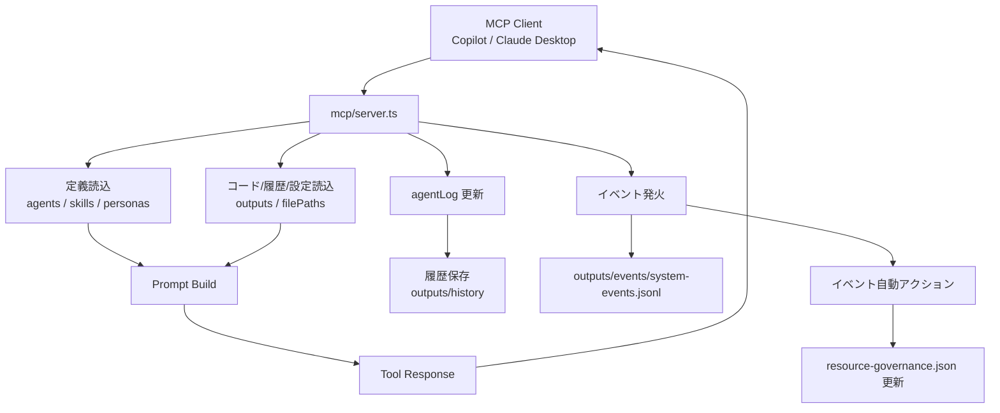
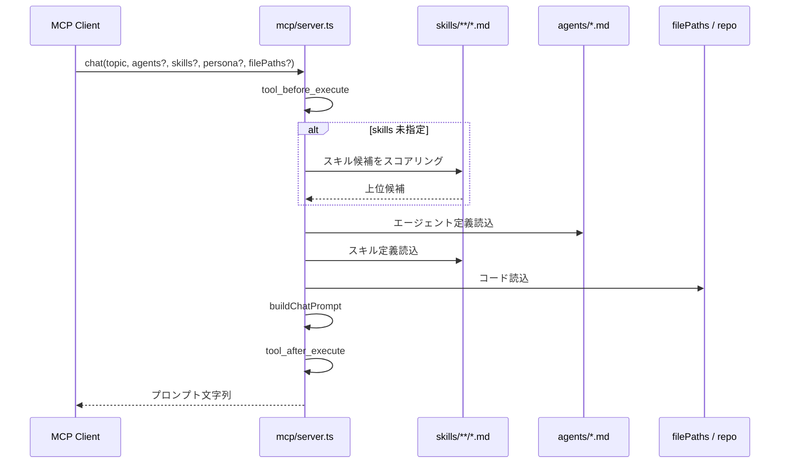
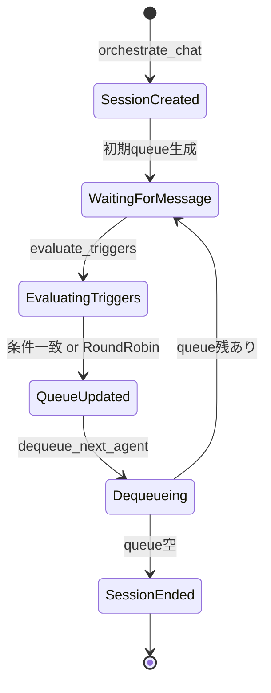
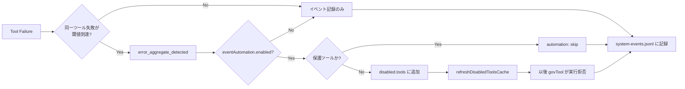
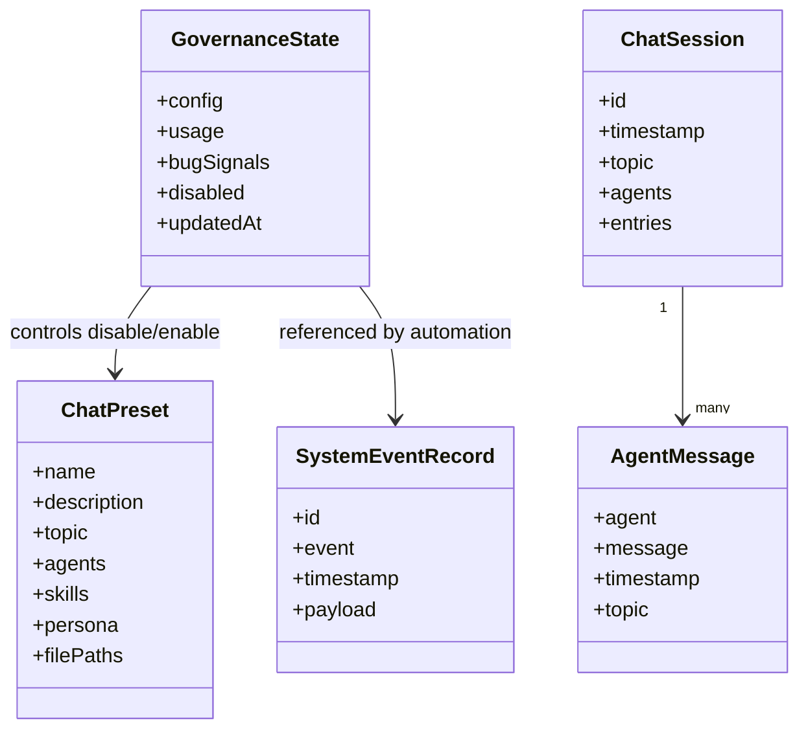

# Salesforce AI Company 仕様書

## 1. 文書目的

本書は Salesforce AI Company の現行実装に対する仕様書です。
対象は MCP サーバー本体、登録ツール、永続化データ、イベント機構、リソース管理、および動作検証方法です。

本書の目的は次の 3 点です。

1. 実装されている振る舞いを仕様として固定すること
2. 利用者と保守者の双方が入出力と副作用を把握できるようにすること
3. 変更後に何をどう検証すればよいかを明確にすること

## 2. システム概要

Salesforce AI Company は、GitHub Copilot や Claude Desktop などの MCP クライアントから利用する Salesforce 向けマルチエージェント支援サーバーです。

主な責務は以下です。

1. エージェント、スキル、ペルソナ、コード断片から会話用プロンプトを構築する
2. 会話ログを記録、保存、復元する
3. 疑似オーケストレーションで次エージェント候補を決定する
4. スキル、ツール、プリセットを検索、自動選択、管理する
5. イベントを記録し、一部イベントを自動アクションへ接続する

## 3. 対象環境

- Node.js 18 以上
- TypeScript 5 系
- GitHub Copilot を使う VS Code
- または Claude Desktop

## 4. 実装構成

主要な実装とデータ配置は以下です。

- サーバー本体: mcp/server.ts
- 個別ツール実装: mcp/tools/*.ts
- エージェント定義: agents/*.md
- ペルソナ定義: personas/*.md
- スキル定義: skills/**/*.md
- プロンプト設計資産: prompt-engine/*
- 永続化出力: outputs/*
- テスト: tests/*.test.ts

出力ディレクトリの用途は以下です。

- outputs/history: 保存済みチャット履歴 JSON
- outputs/presets: チャットプリセット JSON
- outputs/events/system-events.jsonl: システムイベントログ
- outputs/resource-governance.json: リソース管理状態
- outputs/custom-tools: apply_resource_actions で作成されたカスタムツール定義
- outputs/tool-proposals: 将来拡張用の提案出力置き場

## 4.1 主要図

### 全体処理フロー



### chat 系処理シーケンス



### 疑似オーケストレーション状態遷移



### イベント自動化フロー



### 永続化データ構造



## 5. 起動仕様

### 5.1 セットアップ

```bash
npm install
npm run build
```

### 5.2 開発起動

```bash
npm run mcp:dev
```

tsx mcp/server.ts によりソースから直接起動します。

### 5.3 本番相当起動

```bash
npm run mcp:start
```

node dist/mcp/server.js によりビルド成果物から起動します。

### 5.4 プロジェクトルート解決

サーバーは mcp/server.ts の位置から親ディレクトリをたどり、package.json と agents ディレクトリの両方が存在する位置をプロジェクトルートとみなします。

そのため、ソース実行と dist 実行の双方で同一ルートを解決できる構造を前提とします。

## 6. 外部接続仕様

### 6.1 VS Code からの接続

利用先リポジトリの .vscode/mcp.json に以下を設定します。

```json
{
  "servers": {
    "salesforce-ai-company": {
      "type": "stdio",
      "command": "node",
      "args": [
        "D:/Projects/mult-agent-ai/salesforce-ai-company/dist/mcp/server.js"
      ]
    }
  }
}
```

### 6.2 Claude Desktop からの接続

%APPDATA%/Claude/claude_desktop_config.json に以下を設定します。

```json
{
  "mcpServers": {
    "salesforce-ai-company": {
      "command": "node",
      "args": [
        "D:/Projects/mult-agent-ai/salesforce-ai-company/dist/mcp/server.js"
      ]
    }
  }
}
```

## 7. 機能仕様

### 7.1 プロンプト生成

chat 系ツールは LLM への最終回答を生成しません。会話生成やレビュー議論に使うための高品質なプロンプト文字列を返します。

プロンプト構成要素は以下です。

1. コードファイル内容
2. エージェント定義
3. スキル定義
4. ペルソナ定義
5. タスク定義

プロンプトには最低限、以下のセクションが含まれます。

1. 参加エージェント定義
2. 適用スキル
3. ペルソナ
4. タスク

また、会話出力フォーマット規約として、各発言は次の形式を要求します。

- **agent-name**: 発言内容

この規約により、会話文だけを見ても「どの Agent がどの発言をしたか」を判別できます。

### 7.2 自動スキル選択

chat 実行時に skills が未指定の場合、トピックとスキル名・要約を簡易スコアリングし、上位 3 件まで自動選択します。

無効化済みスキルは自動除外されます。

候補が 1 件も選べない場合は low_relevance_detected イベントを発火します。

### 7.3 疑似オーケストレーション

以下のツールで疑似セッションを管理します。

1. orchestrate_chat: セッションを開始し、初期キューとプロンプトを返す
2. evaluate_triggers: 最終発言に対してトリガールールを評価し、次エージェント候補を決定する
3. dequeue_next_agent: キューから次エージェントを取り出す
4. get_orchestration_session: セッション状態を返す

トリガールールは以下の項目を持ちます。

- whenAgent
- thenAgent
- messageIncludes 任意
- reason 任意
- once 任意

一致条件は以下です。

1. whenAgent が一致すること
2. messageIncludes 指定時は発言本文にその文字列を含むこと
3. once が true の場合、同一ルールが未発火であること

一致候補がない場合、fallbackRoundRobin が true ならエージェント一覧の次順で補完します。

### 7.4 ログ管理

会話ログはプロセス内メモリ agentLog に保持されます。

ログ投入方法は以下です。

1. record_agent_message: 単発追加
2. parse_and_record_chat: **agent**: message 形式の会話テキストを一括解析して追加

ログ参照は get_agent_log、永続化は save_chat_history、一覧取得は load_chat_history、復元は restore_chat_history を使います。

save_chat_history は topic が一致するログ、または topic 未設定ログを履歴対象として保存します。

### 7.5 プリセット管理

プリセットは outputs/presets/*.json に保存されます。

プリセットが持つ項目は以下です。

- name
- description
- topic
- agents
- skills
- persona 任意
- filePaths 任意

現在の同梱プリセットは以下です。

1. salesforce-dev-review.json
2. security-compliance-review.json
3. release-readiness-check.json

run_preset 実行時は次を行います。

1. preset_before_execute イベント発火
2. disable 済みプリセットか確認
3. プリセットを読み込み
4. disable 済みスキルを除外
5. プロンプトを生成して返却

### 7.6 リソース検索と自動選択

search_resources は skills、tools、presets を横断検索します。

返却内容は以下です。

1. 入力クエリ
2. 対象リソース種別
3. 種別ごとのスコア付き候補一覧

auto_select_resources はトピックから skills、tools、presets をそれぞれ上位 N 件まで選びます。

いずれも最大スコアが閾値未満の場合は low_relevance_detected を発火します。

### 7.7 スマートコンテキスト

smart_chat は repo_analyze 相当の解析結果から関連ファイル候補を自動抽出し、以下の上限でプロンプトに含めます。

1. Apex 1 件まで
2. LWC 1 件まで
3. Object metadata 1 件まで

合計最大 3 ファイルです。

### 7.8 統計とエクスポート

analyze_chat_trends はエージェント別に以下を集計します。

1. 発言回数
2. 平均文字数
3. 関連トピック一覧

export_to_markdown は履歴、または現在メモリ上のログから Markdown 形式のレポートを生成します。

### 7.9 バッチ処理

batch_chat は複数トピックを順次プロンプト化し、結合したレポート文字列を返します。

入力トピック数は最大 10 件です。

## 8. ツール一覧

### 8.1 解析・実行補助

- repo_analyze
- apex_analyze
- lwc_analyze
- deploy_org
- run_tests
- branch_diff_summary
- branch_diff_to_prompt

### 8.2 定義取得

- list_agents
- get_agent
- list_skills
- get_skill
- list_personas

### 8.3 会話生成

- chat
- simulate_chat
- smart_chat
- batch_chat

### 8.4 オーケストレーション

- orchestrate_chat
- evaluate_triggers
- dequeue_next_agent
- get_orchestration_session

### 8.5 ログ・履歴

- record_agent_message
- get_agent_log
- parse_and_record_chat
- save_chat_history
- load_chat_history
- restore_chat_history
- analyze_chat_trends
- export_to_markdown

### 8.6 プリセット・検索

- create_preset
- list_presets
- run_preset
- search_resources
- auto_select_resources

### 8.7 イベント・自動化

- get_system_events
- get_event_automation_config
- update_event_automation_config

### 8.8 リソースガバナンス

- get_resource_governance
- record_resource_signal
- review_resource_governance
- apply_resource_actions

### 8.9 テストデータ生成

- generate_kamiless_from_requirements
- generate_kamiless_export

## 9. 入力制約仕様

代表的な制約は以下です。

- turns: 1 から 30
- maxContextChars: 500 から 200000
- dequeue_next_agent.limit: 1 から 10
- get_agent_log.limit: 1 から 200
- search_resources.limitPerType: 1 から 20
- auto_select_resources.limitPerType: 1 から 10
- batch_chat.topics: 1 から 10 件
- branch_diff_summary.maxFiles: 1 から 200
- branch_diff_to_prompt.maxHighlights: 1 から 50

## 10. トークン削減仕様

maxContextChars 指定時、コード、エージェント、スキル、ペルソナの各入力に均等配分の文字予算を適用します。

処理手順は以下です。

1. 対象アイテム数を数える
2. maxContextChars / アイテム数 で 1 アイテム予算を決定する
3. 予算超過時は末尾を切り詰め、削減メッセージを付与する

本仕様はトークン数ではなく文字数制御です。

## 11. イベント仕様

### 11.1 イベント保存先

イベントは outputs/events/system-events.jsonl に JSON Lines 形式で追記されます。

各レコードの基本構造は以下です。

```json
{
  "id": "unique-id",
  "event": "tool_before_execute",
  "timestamp": "2026-04-17T03:01:39.617Z",
  "payload": {}
}
```

### 11.2 定義済みイベント

1. session_start
2. turn_complete
3. tool_before_execute
4. tool_after_execute
5. preset_before_execute
6. governance_threshold_exceeded
7. low_relevance_detected
8. history_saved
9. error_aggregate_detected
10. session_end

### 11.3 発火条件

- session_start: orchestrate_chat 成功時
- turn_complete: evaluate_triggers 完了時
- tool_before_execute: govTool で各ツール実行前
- tool_after_execute: govTool で各ツール実行後
- preset_before_execute: run_preset 実行前
- governance_threshold_exceeded: review_resource_governance で整理候補がある場合
- low_relevance_detected: 検索や自動選択のスコアが低い場合
- history_saved: save_chat_history 保存成功時
- error_aggregate_detected: 同一ツールの失敗がウィンドウ内閾値に達した場合
- session_end: dequeue_next_agent 後にキューが空になった場合

### 11.4 エラー集約条件

error_aggregate_detected は以下の条件で発火します。

- 集計窓: 10 分
- 閾値: 3 回
- 再発火クールダウン: 60 秒

## 12. イベント自動アクション仕様

イベント自動化設定は outputs/resource-governance.json の config.eventAutomation に保持されます。

既定値は以下です。

```json
{
  "enabled": true,
  "protectedTools": [
    "apply_resource_actions",
    "get_resource_governance",
    "review_resource_governance",
    "record_resource_signal",
    "get_system_events",
    "get_event_automation_config",
    "update_event_automation_config"
  ],
  "rules": {
    "errorAggregateDetected": {
      "autoDisableTool": true
    },
    "governanceThresholdExceeded": {
      "autoDisableRecommendedTools": false,
      "maxToolsPerRun": 3
    }
  }
}
```

自動アクションは現在以下を実装しています。

1. error_aggregate_detected: 非保護ツールを自動 disable
2. governance_threshold_exceeded: 設定有効時のみ、推奨 disable ツールを自動 disable

自動アクションの結果はイベント payload の automation に記録されます。

## 13. リソースガバナンス仕様

### 13.1 管理対象

1. skills
2. tools
3. presets

### 13.2 管理状態ファイル

outputs/resource-governance.json

### 13.3 既定値

- maxCounts.skills: 30
- maxCounts.tools: 40
- maxCounts.presets: 20
- thresholds.minUsageToKeep: 2
- thresholds.bugSignalToFlag: 2

### 13.4 リスクスコア

レビュー用スコアは以下です。

```text
score = usage - bugSignals * 3
```

### 13.5 review_resource_governance の判定

1. 上限超過時は低スコア順に整理候補を返す
2. usage <= minUsageToKeep かつ bugSignals >= bugSignalToFlag の場合も整理候補を返す
3. tools は disable 候補、skills と presets は delete 候補として返す

### 13.6 apply_resource_actions の反映

#### skills

- create: skills/<name>.md を作成
- delete: 該当 markdown を削除
- disable/enable: disabled.skills を更新

#### tools

- create: outputs/custom-tools/<name>.json を作成し、その場で登録
- delete: カスタムツールなら JSON 削除、組み込みツールなら disable 扱い
- disable/enable: disabled.tools を更新

#### presets

- create: outputs/presets/<name>.json を作成
- delete: 該当 JSON を削除
- disable/enable: disabled.presets を更新

### 13.7 実行時ガード

- disable 済み tools は govTool が実行拒否する
- disable 済み skills は chat、smart_chat、orchestrate_chat、run_preset で自動除外する
- disable 済み presets は run_preset が実行拒否する

## 14. 動作検証方法

### 14.1 自動テスト

以下を実行します。

```bash
npm test
```

現時点のテスト対象は以下です。

1. コアツール登録
2. repo/analyzer 系ツール
3. branch diff 系ツール
4. prompt/memory 系ツール
5. イベント自動化設定
6. error_aggregate_detected による自動 disable

期待結果:

1. 全テストが pass する
2. fail、cancelled が 0 件である

### 14.2 ビルド確認

以下を実行します。

```bash
npm run build
```

期待結果:

1. TypeScript ビルドが完了する
2. dist/mcp/server.js が更新される

### 14.3 ローカル起動確認

以下を実行します。

```bash
npm run mcp:dev
```

または

```bash
npm run mcp:start
```

期待結果:

1. サーバーが異常終了しない
2. MCP クライアントからツール一覧取得ができる

### 14.4 手動検証シナリオ

#### シナリオ A: chat の基本動作

入力例:

```text
chat:
  topic: "Apexトリガー改善"
  agents: ["architect", "qa-engineer"]
  skills: ["apex/apex-best-practices"]
  turns: 3
```

確認点:

1. 出力に ## 参加エージェント定義 を含む
2. 出力に トピック: 「Apexトリガー改善」 を含む

#### シナリオ B: ログ記録

入力例:

```text
parse_and_record_chat:
  topic: "integration-test"
  chatText: "**architect**: 設計を見直します\n**qa-engineer**: 回帰テストを追加します"
```

続けて:

```text
get_agent_log:
  agent: "architect"
  limit: 5
```

確認点:

1. recorded が 2
2. architect のログが取得できる

#### シナリオ C: 履歴保存

入力例:

```text
save_chat_history:
  topic: "integration-test"
```

続けて:

```text
load_chat_history: {}
```

確認点:

1. 保存 ID が返る
2. outputs/history に JSON が生成される
3. history_saved イベントが記録される

#### シナリオ D: イベント参照

入力例:

```text
get_system_events:
  limit: 20
```

確認点:

1. tool_before_execute または tool_after_execute が含まれる
2. 直近のイベント件数が返る

#### シナリオ E: 自動スキル選択

入力例:

```text
chat:
  topic: "Apex セキュリティレビュー"
  turns: 3
```

確認点:

1. スキル未指定でもプロンプトが返る
2. 関連スキルが選べない場合は low_relevance_detected が残る

#### シナリオ F: プリセット実行

入力例:

```text
list_presets: {}
```

続けて任意の名前で:

```text
run_preset:
  name: "Salesforce 開発レビュー"
```

確認点:

1. プリセット由来のプロンプトが返る
2. preset_before_execute イベントが残る

#### シナリオ G: イベント自動 disable

事前確認:

```text
get_event_automation_config: {}
```

期待値:

1. enabled が true
2. errorAggregateDetected.autoDisableTool が true

再現方法:

1. 存在しない agent 名で get_agent を 3 回以上連続実行する
2. get_resource_governance を実行する
3. get_system_events で error_aggregate_detected を確認する

確認点:

1. disabled.tools に get_agent が含まれる
2. 対象イベント payload の automation.action が disable-tool

復旧方法:

```text
apply_resource_actions:
  actions:
    - resourceType: "tools"
      action: "enable"
      name: "get_agent"
```

#### シナリオ H: ガバナンス見直し

入力例:

```text
record_resource_signal:
  resourceType: "skills"
  name: "security/secure-apex"
  usageIncrement: 3
  bugIncrement: 1
```

続けて:

```text
review_resource_governance:
  updateMaxCounts: { skills: 30, tools: 40, presets: 20 }
  updateThresholds: { minUsageToKeep: 2, bugSignalToFlag: 2 }
```

確認点:

1. counts と thresholds が返る
2. 条件に応じて recommendations が返る

## 15. 既知の前提と注意事項

1. chat 系は LLM の最終回答ではなく、プロンプト文字列を返す
2. トークン制御は文字数ベースであり、厳密な token 数制御ではない
3. イベント自動 disable は resource-governance.json に永続化される
4. テストで故意に失敗を発生させた場合は、disable されたツールを必ず enable に戻すこと
5. // @ts-nocheck が付いているため、型安全性よりも実行互換を優先している箇所がある

## 16. 変更時の最低確認項目

仕様変更、ツール追加、イベント追加、README 更新のいずれかを行った場合は、最低限以下を確認します。

1. npm test
2. npm run build
3. 影響したツールの手動シナリオ 1 件以上
4. outputs 配下に出力される副作用の確認

diff 解釈ルール:

1. `+` で始まる追加行だけを対象にする
2. `label` / `field_label` / `field_type` / `object_name` / `field_name` / `required` / `options` を持つオブジェクト断片を候補として組み立てる
3. 組み立てた候補を通常の要件行へ変換して、要件本文の後ろに追加して解釈する
4. diff だけではラベルが取れない断片は無視する

解釈できなかった行はレスポンスの `未解釈行` に一覧表示されます。
