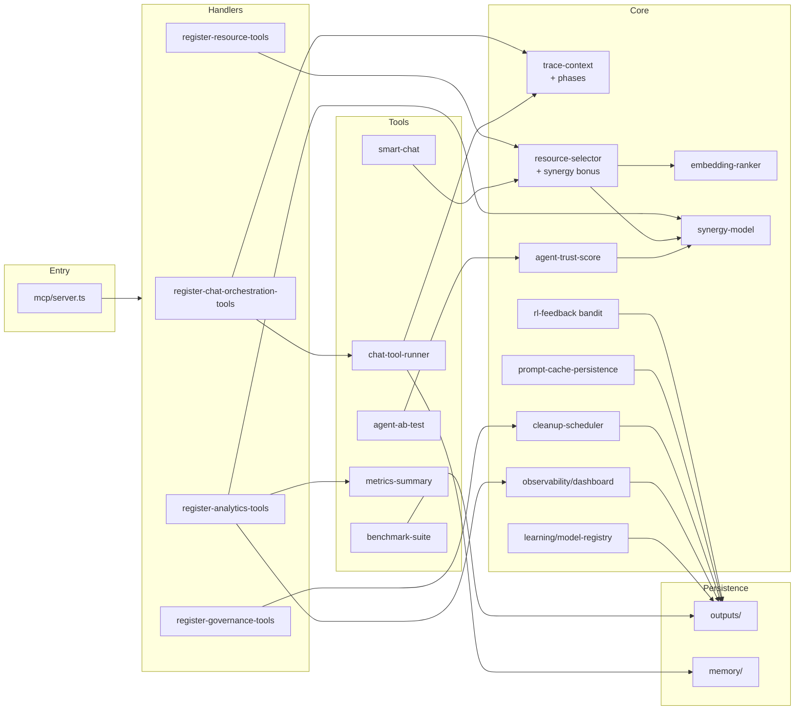
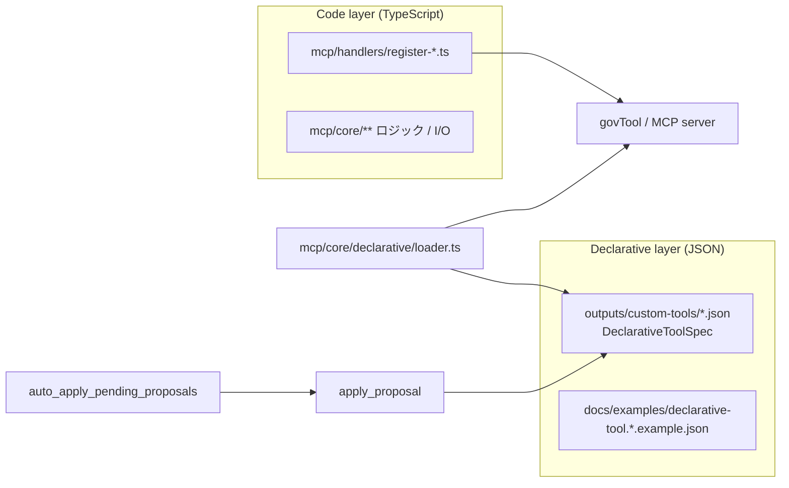

# アーキテクチャ概要

このドキュメントは、本リポジトリの設計を短時間で把握するための導線です。
詳細な UML 図は `system-architecture-with-uml.md` を参照してください。

## 1. システムの目的

Salesforce 開発業務を対象に、MCP サーバとして次の機能を提供します。

- 解析: Apex / LWC / Flow / Permission Set などの静的・差分解析
- 計画: デプロイ計画、テスト推定、PR レビュー支援
- 対話: 複数エージェントによる chat / orchestrate
- 運用: ガバナンス制御、イベント自動化、メトリクス集計

## 2. レイヤ構成

### Entry / Composition

- `mcp/server.ts`
  - MCP サーバのエントリポイント
  - 各 register モジュールを呼び出してツール登録

### Handler Layer

- `mcp/handlers/`
  - `register-*.ts` がツール群をカテゴリ単位で登録
  - イベント連携、オート初期化、統計集計を担当

### Tool Layer

- `mcp/tools/`
  - ユースケース単位の業務ロジック
  - 入出力検証、Git 呼び出し、Salesforce コマンド連携など

### Core Layer

- `mcp/core/`
  - `quality/`: zod を使った検証 / `agent-trust-score` (synergy bonus 対応) / `scan-exclusions` (`.sf` / `.sfdx` / `node_modules` 等の走査除外を集中管理)
  - `resource/`: リソース選択・提案・スコアリング / `embedding-ranker` (n-gram cosine hybrid) / `synergy-model` / `query-intent-classifier` / `usage-pattern` / `cascading-delete` / `cleanup-scheduler` / `feedback-loop-visualization` (rejectReason 分布・heatmap・トレンド)
  - `governance/`: しきい値、上限、disable 状態管理 / `defaults` (既定値の一元管理) / `governance-ui` (HTML/Markdown レンダラ) / `handler-schedule` (allow/deny + wrap-around 時間帯)
  - `event/`: イベント発火と履歴管理
  - `trace/`: トレース文脈管理 (`startPhase`/`endPhase`/`withPhase` で input/plan/execute/render を計測)
  - `learning/`: `rl-feedback` (Thompson sampling bandit) / `model-registry` (shadow/promote/rollback) / `model-arbitration` (shadow vs production アービトレーション)
  - `observability/`: `dashboard` (HTML/Markdown/JSON 出力) / `dashboard-drill-down` (filter / 5 秒窓相関)
  - `context/`: `persona-style-registry` / `prompt-cache-persistence` / `context-budget` (tokens × priority カット) / `prompt-rendering`
  - `errors/`: `messages` (errorCode テーブル) と `i18n/` ロケール辞書による多言語化
  - `org/`: Salesforce Org カタログの永続化と CRUD
  - `layer-manifest`: レイヤ依存制約 (Lint は [`scripts/lint-core-layers.ts`](../scripts/lint-core-layers.ts))
  - `logging/`: ログ出力制御

### Knowledge Layer

- `agents/`, `skills/`, `personas/`, `context/`
  - プロンプト生成時に参照する定義群
- `prompt-engine/`
  - プロンプト組み立て、評価、レビュー補助

### Persistence Layer

- `outputs/`
  - events / history / sessions / presets / governance 状態
- `memory/`
  - `project-memory.ts`, `vector-store.ts`
  - JSONL 永続化 + LRU ベースのレコード管理

## 3. 代表的な処理フロー

### Smart Chat

1. `smart_chat` が topic から関連ファイル・リソース候補を抽出
2. prompt-engine がコンテキストを統合してプロンプト生成
3. エージェント構成で応答を作成
4. 必要に応じてログ・履歴へ記録

### Resource Governance

1. リソース変更要求を受け付け
2. 品質チェックと重複チェックを実施
3. ガバナンス上限を評価
4. 変更反映とイベント発火
5. 統計・履歴を `outputs/` へ保存

### Orchestration

1. セッションを作成してキューを初期化
2. `dequeue_next_agent` で担当エージェントを順次取得
3. `evaluate_triggers` でルール評価
4. 履歴とセッション状態を更新

## 5. サブシステム関係図

下図は 2026-04 Phase 2〜4 完了時点の主要サブシステム間の依存関係を表します。
リリース毎にこの図を更新してください。

## 6. 非機能観点

- 安全性
  - 入力検証を共通化し、危険なパスや識別子を遮断
- 観測性
  - trace と metrics を JSONL へ継続記録
- 拡張性
  - register モジュール分割で機能追加しやすい構造
- 運用性
  - `npm run ci` で typecheck + test + dependency audit を一括実行

## 7. 参照順序

1. `README.md`（概要と起動）
2. `docs/documentation-map.md`（索引）
3. `docs/features/`（機能別）
4. `system-architecture-with-uml.md`（詳細 UML）

## 8. ツール定義の二層構造 (Declarative + Code)

MCP ツールは責務の性質に応じて 2 つの層で管理する。境界線を明確化することで、
LLM やノンエンジニアからの安全な追加 (Declarative 層) と、副作用のあるエンジン実装
(Code 層) を分離する。

### 分類基準

| 観点 | Declarative | Code |
|---|---|---|
| 入力検証以外の TS ロジックが必要 | 不要 | 必要 |
| 副作用 (fs / network / exec) | 無し | 有り |
| 出力 | 既存 prompt builder 合成 / 固定テキスト | 任意 |
| 追加方法 | `enqueue_proposal` → `apply_proposal` | TS 実装 + register 関数 |
| スキーマ | [`DeclarativeToolSpec`](../mcp/core/declarative/tool-spec.ts) | 各 handler 内 zod |

### 対応する action kind

- `compose-prompt` … `agents` / `persona` / `skills` を束ねたチャットプロンプト合成
- `static-text` … 固定テキスト返却 (FAQ / テンプレート)

将来追加候補: `call-tool` (別 MCP ツールへの委譲), `pipeline` (ツール連鎖)。

### 関連モジュール

- [`mcp/core/declarative/tool-spec.ts`](../mcp/core/declarative/tool-spec.ts) — zod スキーマと legacy 互換変換
- [`mcp/core/declarative/loader.ts`](../mcp/core/declarative/loader.ts) — `outputs/custom-tools/` 動的ロード
- [`mcp/core/declarative/frontmatter.ts`](../mcp/core/declarative/frontmatter.ts) — agents/personas/skills 用 (opt-in)
- [`mcp/core/resource/proposal-applier.ts`](../mcp/core/resource/proposal-applier.ts) — 提案を新スキーマで物理書き込み
- [`scripts/lint-outputs.ts`](../scripts/lint-outputs.ts) — `outputs/custom-tools/*.json` の DeclarativeToolSpec 検証
- 例示ファイル: [`docs/examples/declarative-tool.compose-prompt.example.json`](./examples/declarative-tool.compose-prompt.example.json) / [`docs/examples/declarative-tool.static-text.example.json`](./examples/declarative-tool.static-text.example.json)

