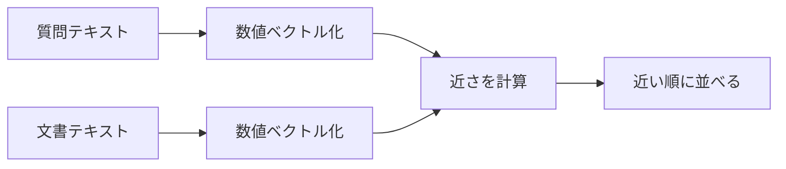
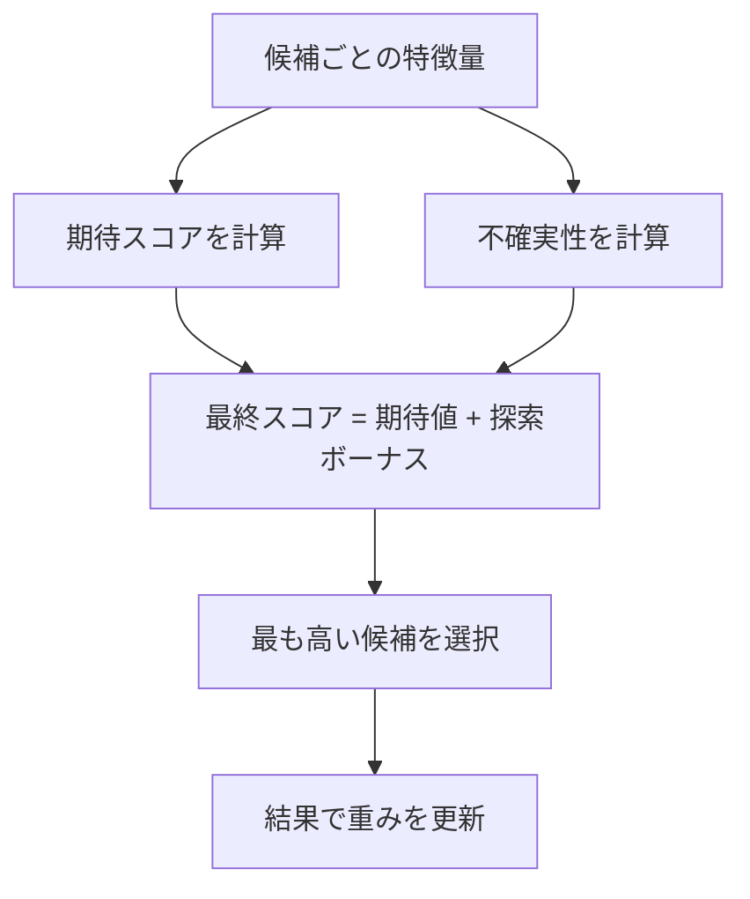
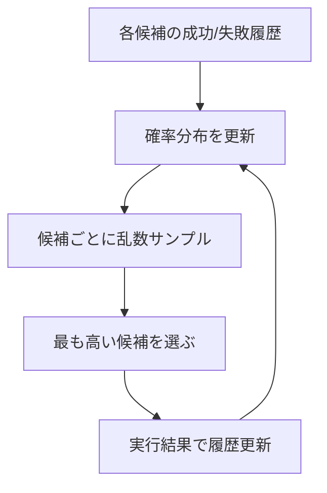
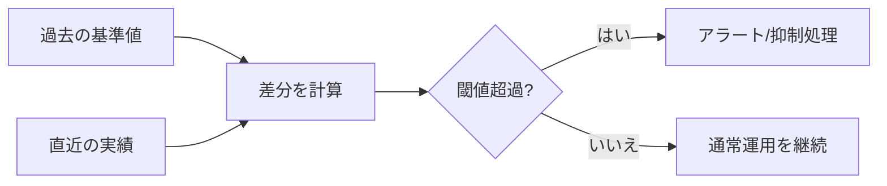
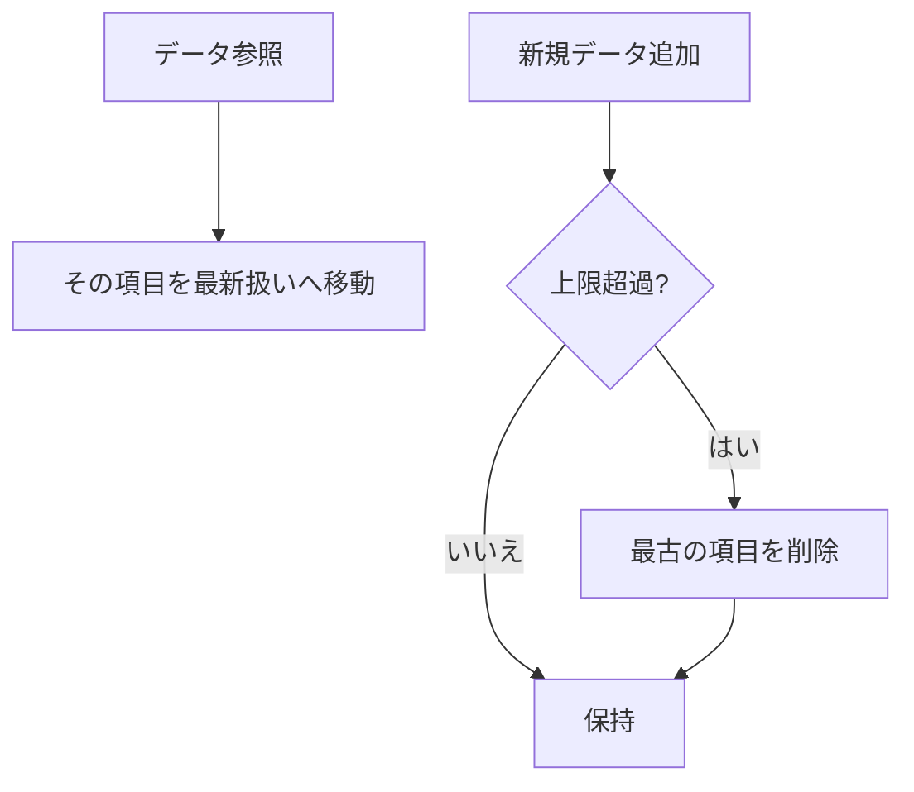
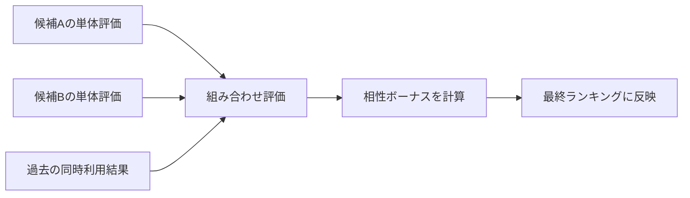
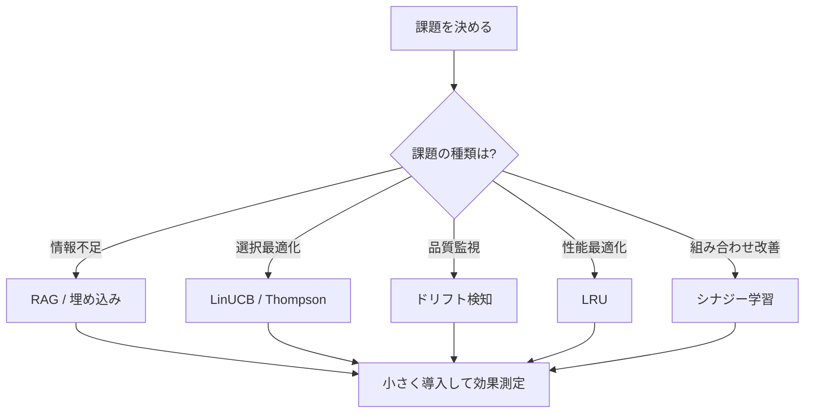

# 非エンジニア向け用語集

このドキュメントは、このリポジトリでよく使う言葉を「業務目線」で短く説明したものです。
技術詳細よりも、意味と使いどころを優先しています。

## まず押さえる 10 語

| 用語 | ひとことで言うと | このリポジトリでは |
|---|---|---|
| MCP | AI と外部機能をつなぐ共通ルール | AI がこのプロジェクトの機能を安全に呼び出すための土台 |
| MCP サーバー | 機能をまとめて公開する入口 | `mcp/server.ts` でツール群を公開 |
| ツール | AI が実行できる機能の単位 | 解析、比較、提案、集計などを 1 機能ずつ提供 |
| エージェント | 役割を持った AI 担当者 | architect や qa-engineer など、担当ごとに応答が変わる |
| スキル | エージェントが参照する専門知識 | Apex、セキュリティ、テストなどの知識セット |
| ペルソナ | 話し方や視点のキャラクター | engineer、doctor など。説明スタイルを調整する |
| プロンプト | AI への指示文 | context、agent、skill を組み合わせて生成 |
| オーケストレーション | 複数エージェントの進行管理 | 誰が次に話すかをルールで決める |
| outputs | 実行結果の保存先 | 履歴、レポート、学習データを保存する重要フォルダ |
| doctor | 設定不備を先に見つける診断 | `npm run ai -- doctor` で初期チェック |

## 運用でよく出る言葉

| 用語 | 意味 | 何を判断するときに使うか |
|---|---|---|
| ガバナンス | 運用ルールと安全制御 | 自動適用してよいか、停止すべきか |
| メトリクス | 定量的な状態指標 | 品質が上がっているか、悪化しているか |
| イベント | 起きた出来事の記録 | 異常検知や自動アクションのトリガー |
| セッション | 一連の会話や処理のまとまり | どの文脈で判断したかを追跡 |
| 提案 (proposal) | 変更候補の案 | 承認するか、却下するか |
| トレース | 処理の流れの記録 | どこで遅いか、どこで失敗したか |
| 監査ログ | 後で確認するための証跡 | 変更の説明責任や振り返り |
| バックアップ | 復旧用の退避データ | 誤操作時に戻せるか |

## AI 学習・検索まわりの言葉

| 用語 | 意味 | このリポジトリでの使い方 |
|---|---|---|
| ベクトルストア | 似た情報を探しやすくした保存方式 | 過去知識や履歴から関連情報を引く |
| 埋め込み (embedding) | 文章を比較しやすい数値にしたもの | 質問と関連ドキュメントの近さを測る |
| RAG | 必要情報を先に検索してから回答する方法 | 回答前に失敗事例や関連資料を注入 |
| ドリフト | 以前より性能がずれる現象 | 学習効果の劣化を検知 |
| A/B テスト | 2 案を比較する評価方法 | どのテンプレートが良いかを判断 |
| LinUCB / Thompson | 探索と活用の意思決定手法 | 新案を試すか、実績案を使うかを調整 |
| シナジー | 組み合わせ効果 | エージェントやリソースの相性を学習 |
| コールドスタート | 実績がない初期状態 | 新規エージェントをどう評価するか |

## 品質・保守まわりの言葉

| 用語 | 意味 | 現場での見方 |
|---|---|---|
| typecheck | 型の整合チェック | 実行前に設計ミスを早期発見 |
| テスト | 期待どおり動くかの確認 | 変更の安全性を担保 |
| フォールバック | 代替経路で継続する設計 | 一部失敗でも全体停止を避ける |
| タイムアウト | 待ち時間の上限 | 外部連携のハング防止 |
| LRU | 最近使ったものを優先保持する方式 | メモリ使用量を抑えつつ速度を維持 |
| 依存関係 | 機能同士のつながり | 変更時の影響範囲を読む |

## 読み方のコツ

- まずは「まず押さえる 10 語」だけ見れば十分です。
- 次に、自分の業務に近い章だけ拾い読みしてください。
- 分からない言葉が残ったら、該当ドキュメントへ移動します。

## 関連ドキュメント

- 全体像: [README.md](../README.md)
- 詳細索引: [docs/documentation-map.md](./documentation-map.md)
- 運用手順: [docs/operations-guide.md](./operations-guide.md)
- 開発向け詳細: [docs/developer-guide.md](./developer-guide.md)

## 補足: アルゴリズムの原理 (図つき)

ここでは、名前だけだと分かりにくいアルゴリズム系の用語を「何を入力して、どう判断し、何を出すか」で説明します。

### 1. RAG (検索してから答える)

- 原理: 先に関連情報を取り出して、回答時に参照する
- 狙い: 思い込み回答を減らし、根拠つきで答える

### 2. 埋め込み (embedding) と類似度

- 原理: 文章を数値ベクトルに変換し、距離の近さで関連度を測る
- 狙い: 単語の完全一致がなくても「意味が近い」情報を探せる

### 3. LinUCB (文脈付きの探索と活用)

- 原理: 期待値が高い候補を選びつつ、不確実性が高い候補も一定割合で試す
- 狙い: 安定運用と新規発見を両立する

### 4. Thompson Sampling (確率的な探索)

- 原理: 「この案は当たりそう」という確率分布からサンプルし、値が高い案を選ぶ
- 狙い: 実績が少ない案にもチャンスを与えつつ、良い案へ収束する

### 5. ドリフト検知 (性能のずれを見つける)

- 原理: 直近の指標と過去の基準を比べ、差が閾値を超えたら異常とみなす
- 狙い: 品質低下を早く見つけて、対策を打てるようにする

### 6. LRU (最近使ったものを優先)

- 原理: 保存上限を超えたとき、最も長く使っていないデータから削除する
- 狙い: メモリ使用量を抑えながら、よく使うデータの速度を保つ

### 7. シナジー学習 (組み合わせ効果)

- 原理: 単体の良し悪しだけでなく「組み合わせたときの成果」を学習する
- 狙い: 相性の良いエージェント・リソースの組み合わせを優先する

### 使い分けの目安

- まず必要情報を集めたい: RAG
- 候補選択を自動最適化したい: LinUCB / Thompson Sampling
- 品質悪化を早期検知したい: ドリフト検知
- 速度とメモリを両立したい: LRU
- チーム編成や組み合わせ最適化をしたい: シナジー学習

## 補足: 業務シーン別の使い分け

「結局どれを使えばいいか」を、よくある場面ごとに整理します。

| 業務シーン | まず使う考え方 | 期待できる効果 | 補足 |
|---|---|---|---|
| 障害や失敗の再発を防ぎたい | RAG + ドリフト検知 | 過去の失敗事例を参照しつつ、品質低下を早く検知できる | 定期的にメトリクス確認をセットで実施 |
| 複数の対応案から最適案を選びたい | LinUCB / Thompson Sampling | 実績のある案を使いながら、新しい案も試せる | 初期は探索を厚めにすると学習が進みやすい |
| 回答の関連度を上げたい | 埋め込み + 類似度検索 | 単語一致に頼らず、意味が近い情報を引ける | 用語ゆれが多い業務文書で有効 |
| システムを重くせず運用したい | LRU | メモリを抑えつつ、よく使うデータは速く扱える | 保存上限の設計が重要 |
| 担当者や役割の組み合わせを改善したい | シナジー学習 | 相性の良い組み合わせを優先できる | 単体評価だけで判断しないのがポイント |

### ミニフロー: 何から始めるか

### 実務での進め方 (非エンジニア向け)

1. まず「何を改善したいか」を 1 つに絞る
2. 上の表から対応する考え方を 1 つ選ぶ
3. 小さく試す (対象範囲・期間を限定)
4. メトリクスで前後比較し、良ければ拡大する
