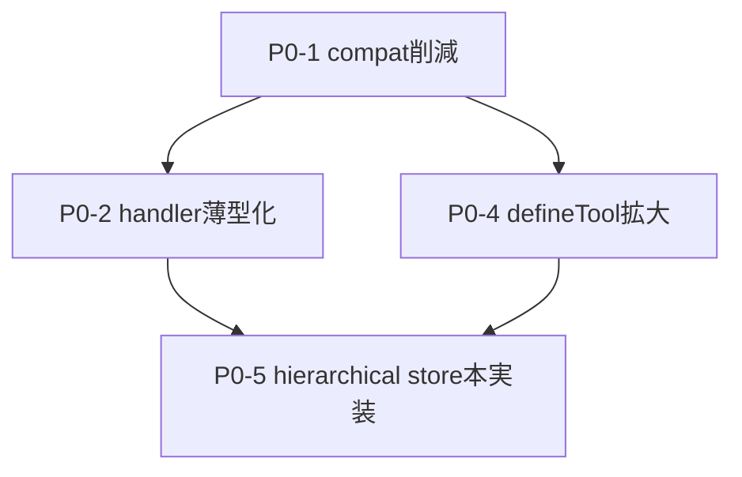

# Persistent AI Runtime — 改修タスク一覧

- 出典: [persistent-ai-runtime-review-2026-05-08.md](persistent-ai-runtime-review-2026-05-08.md)
- 対象: `salesforce-ai-company`
- 作成日: 2026-05-08
- フォーマット: Task ID / 概要 / 変更内容 / 修正ファイル / 影響範囲

---

## 優先度サマリ

| Phase | 期間 | Task 数 | 主目的 |
|---|---|---:|---|
| **P0** | now → 2 ヶ月 | 5 | Layering 健全化・runtime崩壊リスク解消 |
| **P1** | 3 → 6 ヶ月 | 5 | Transport 拡張・観測性完備・port 強制 |
| **P2** | 6 ヶ月+ | 5 | 分散化・スキーマ進化対応 |
| **継続/運用** | 常時 | 5 | Enterprise 機能・運用品質 |

総タスク: **20**

---

## P0 ToDoMap（2026-05-12）

### 実行順（上から順に対応）

1. P0-1: compat 層の残変換を段階削減（最優先）
2. P0-4: defineTool 適用範囲の拡大（handler 登録スキーマ統一）
3. P0-5: hierarchical store の pgvector 本実装

### ステータス

- [x] P0-3: 完了（クローズ）
- [x] P0-1: 完了（クローズ）
- [x] P0-2: 完了（handler薄型化とservice退避をクローズ）
- [ ] P0-4: 進行中（descriptor 基盤完了、適用拡大残）
- [x] P0-5: 完了（pgvector 永続ストア直結をクローズ）

### P0 残タスク（次アクション）

1. P0-4: `defineTool` 適用範囲の拡大（handler 登録スキーマ統一）

### フロー図



---

## 進捗スナップショット（2026-05-12）

| Task | 状態 | 今回の実施内容 |
|---|---|---|
| P0-3 | **完了（クローズ）** | module-init副作用の主要箇所を lazy 化。`analyticsStorePromise` 直保持を共通 provider 経由に置換 |
| P0-3 | 追加成果 | `mcp/core/persistence/analytics-store-provider.ts` を新設し、DB URL変更時の再解決に対応 |
| P0-3 | 追加成果 | `mcp/core/persistence/pg-pool-registry.ts` を新設し、`db/client.ts` を registry 経由に統合 |
| P0-3 | 追加成果 | persistence モジュールの pool 直生成を registry 経由へ移行（`session-store.postgres.ts` / `postgres-store.ts` / `postgres-runtime-log-store.ts` / `advisory-lock.ts`） |
| P0-3 | 追加成果 | `PostgresAnalyticsStore` / `AuditWriter` / `PostgresOrchestrationSessionStore` の pool 直生成を registry 経由へ統一し、`close()` を ref-count release に統一 |
| P0-3 | 追加成果 | 残りの直生成（`job-runner.ts` / `governance-state-manager.ts` / `pg-boss-proposal-queue.ts` / `pgvector-vector-store.ts`）も registry 経由へ移行し、`new Pool(...)` は `pg-pool-registry.ts` のみへ集約 |
| P0-3 | 追加成果 | learning 系の env 直読を段階削減し、`runtime-config.ts` の `getOutputsDir()` / `getPrimaryDatabaseUrl()` を導入（`failure-memory-rag.ts` / `learning-dashboard-generator.ts` / `staged-adoption.ts` / `rl-feedback.ts`） |
| P0-3 | 追加成果 | `metrics-auto-update.ts` の drift/metrics 設定読込も `runtime-config.ts` の `getMetricsAutoUpdateEnvConfig()` 経由に統一し、`mcp/core/learning/**` の `process.env` 直読を解消 |
| P0-3 | 追加成果 | registry 運用ポリシー（共有粒度・close責務・キー命名規約）と RuntimeConfig 運用ルール（適用規約・完了判定チェックリスト）を文書化 |
| P0-3 | 追加成果 | resource/governance/event へ RuntimeConfig 適用を展開し、`mcp/core/resource/**` / `mcp/core/governance/**` / `mcp/core/event/**` の `process.env` 直読を解消 |
| P0-3 | 追加成果 | trace/quality/context に RuntimeConfig 適用を追加展開し、`mcp/core/trace/**` / `mcp/core/quality/**` / `mcp/core/context/**` の `process.env` 直読を解消 |
| P0-3 | 追加成果 | i18n/logging/io に RuntimeConfig 適用を追加展開し、`mcp/core/i18n/**` / `mcp/core/logging/**` / `mcp/core/io/**` の `process.env` 直読を解消 |
| P0-3 | 追加成果 | observability に RuntimeConfig 適用を追加展開し、`mcp/core/observability/**` の `process.env` 直読を解消 |
| P0-3 | 追加成果 | security に RuntimeConfig 適用を追加展開し、`mcp/core/security/**` の `process.env` 直読を解消 |
| P0-3 | 追加成果 | LLM/persistence の残存直読を追加解消（`quality-rubric.ts` / `langchain-embedding.ts` / `langchain-llm.ts` / `analytics-store-provider.ts` を RuntimeConfig 経由へ統一） |
| P0-3 | 追加成果 | core 外ハンドラーの env 直読を追加解消（`register-analytics-tools.ts` / `register-resource-search-tools.ts` / `register-resource-governance-tools.ts` を `getOutputsDir` / `getPrimaryDatabaseUrl` 経由へ統一） |
| P0-3 | 追加成果 | core 外ハンドラー/ツールの env 直読を追加解消（`register-org-catalog-tools.ts` / `register-proposal-queue-tools.ts` / `analyze-test-coverage-gap.ts` / `recommend-permission-sets.ts` / `run-deployment-verification.ts` を RuntimeConfig helper 経由へ統一） |
| P0-3 | 追加成果 | 残存ハンドラー env 直読を追加解消（`register-vector-prompt-tools.ts` / `register-smart-chat-tools.ts` / `resource-gap.handler.ts` / `threshold.handler.ts` / `auto-init.ts` を RuntimeConfig helper または env-agnostic ログへ統一） |
| P0-3 | クローズ判定 | `mcp/handlers/**/*.ts` の `process.env` 直読は 0 件。typecheck と指定 8 テスト（resource-selection-confidence / self-refine-loop）も成功 |
| P0-1 | **着手** | port interface 群（7種）と `HandlerContext` / `composition-root` を追加し、旧 deps 併存の bridge 土台を作成 |
| P0-1 | 追加成果 | `registerServerTools()` で `HandlerContext` bridge を生成して返却する経路を接続（server から取得可能化） |
| P0-1 | 追加成果 | `register-all-tools-deps.ts` の互換ラッパ（preset/custom-tool/system-event/dashboard/export/event 変換）を `register-all-tools-deps-compat.ts` に抽出し、中核ファイルの責務を分割 |
| P0-1 | 追加成果 | `BuildRegisterAllToolsDepsOptions` を `register-all-tools-deps-options.ts` へ分離し、`register-all-tools-deps.ts` から巨大型定義責務を切り離し |
| P0-1 | 追加成果 | `buildHandlerContextBridge` を `register-all-tools-handler-context-bridge.ts` へ抽出し、`register-all-tools-deps.ts` は再エクスポートのみへ整理 |
| P0-1 | 追加成果 | `buildRegisterAllToolsDeps` の巨大 return マッピングを `register-all-tools-deps-builder.ts` へ抽出し、`register-all-tools-deps.ts` を薄いオーケストレーター化 |
| P0-1 | 追加成果 | `BuildRegisterAllToolsDepsOptions` を domain 別 interface（core/chat/governance/preset/memory/search/custom-tool）へ分割し、型責務を段階分離 |
| P0-1 | 追加成果 | `register-all-tools-deps-builder.ts` のマッピングを section helper（core/session・governance・preset/prompt・memory/search・catalog/custom-tool）へ分割 |
| P0-1 | 追加成果 | `register-all-tools-deps-builder.ts` の section helper 戻り型を `Pick<RegisterAllToolsDeps, ...>` で厳密化し、`as RegisterAllToolsDeps` キャストを除去 |
| P0-1 | 追加成果 | analytics handler 定義の `any` 依存を削減（`get-handlers-dashboard.ts` / `health-check.ts` の deps を厳密型へ置換） |
| P0-1 | 追加成果 | `register-all-tools-deps-compat.ts` の unsafe cast を削減（dashboard/event/export の変換を型ガード/判定関数へ置換）し、`BuildRegisterAllToolsDepsOptions` の dashboard 型境界を `unknown` から明示Unionへ厳密化 |
| P0-1 | 追加成果 | `server.ts` の `registerServerTools(...)` 巨大引数を domain 別 deps 束（core/chat/governance/preset/memory/search/custom-tool）へ分割し、bridge入力境界を可視化 |
| P0-1 | 追加成果 | `loadSystemEvents` / `exportStatisticsAsCsv` / `exportStatisticsAsJson` を compat 経由から options 直結へ切替し、`register-all-tools-deps-compat.ts` の変換責務をさらに縮小 |
| P0-1 | 追加成果 | `generateHandlersDashboard` を compat 変換から options 直結へ切替し、dashboard 用の legacy 変換責務を削除 |
| P0-1 | 追加成果 | `ResourceOperation` の型境界（core/governance）を統一し、`loadRecentOperations` を compat 変換から options 直結へ切替 |
| P0-1 | 追加成果 | `emitEvent` を compat 変換から options 直結へ切替し、`SystemEventType` に `cascade_impact_detected` を追加して resource action 側イベント型を整合 |
| P0-1 | 追加成果 | `createPreset` / `registerCustomTool` も options 直結へ移行し、`register-all-tools-deps-compat.ts` を削除（互換層を実質解消） |
| P0-1 | 追加成果 | bridge で残っていた `legacyDeps` の unsafe cast（`as unknown as Record<string, unknown>`）を除去し、`HandlerContext.legacyDeps` を optional 化して DI 境界を明確化 |
| P0-1 | 追加成果 | `HandlerContext` / `composition-root` / `tool-registry` / `register-all-tools-handler-context-bridge` から `legacyDeps` bridge 自体を削除し、旧 deps 受け渡し経路をさらに縮小 |
| P0-1 | 追加成果 | `register-all-tools-deps.ts` から `buildHandlerContextBridge` の再 export を除去し、未使用となった `register-all-tools-handler-context-bridge.ts` を削除 |
| P0-1 | 追加成果 | `tool-registry.ts` を `register-all-tools-deps-builder.ts` / `register-all-tools-deps-options.ts` へ直結し、薄い中継だった `register-all-tools-deps.ts` を削除 |
| P0-1 | 追加成果 | `composition-root.ts` の awilix 登録を `asValue(...)` へ統一し、`as any` キャストを除去して DI 境界の型厳密性を向上 |
| P0-1 | 追加成果 | `composition-root.ts` の awilix 設定を `strict: true` に変更し、未登録依存の見逃しを防ぐ設定へ移行 |
| P0-1 | 追加成果 | `server.ts` の `*Compat` 橋渡し命名を整理（`emitSystemEventFromTools` / `buildChatPromptForTools` / `getHandlerContextForTest`）し、既存テスト向けに alias を維持 |
| P0-1 | 残タスク棚卸し | deps 組立の中継レイヤは解消済み。残りは DI コンテナ運用の最終化（awilix 依存解決境界の厳密化と bridge 段階クローズ） |
| P0-2 | **着手** | fat handler 分割を開始（起点: `register-resource-search-tools.ts`） |
| P0-2 | 追加成果（Analytics） | `register-analytics-tools.ts` の主要ロジックを `core/application/analytics/services/*` へ集約（集計・評価・Markdown整形・SLA/コスト・feedback・dashboard 系） |
| P0-2 | 追加成果（Chat/Orchestration） | `register-chat-orchestration-tools.ts` の実行本体を `core/application/chat/services/*` へ集約（session管理・trigger評価・dequeue・orchestrate・response整形） |
| P0-2 | 追加成果（Governance/Resource） | proposal queue / governance / resource-action / resource-search の実行本体を `core/application/governance/services/*` と `core/application/resource/services/*` へ抽出 |
| P0-2 | 追加成果（Analysis/Prompt） | core-analysis・vector/prompt quality の実行本体を `core/application/analysis/services/*` / `core/application/prompt/services/*` へ抽出 |
| P0-2 | 追加成果（Register薄型化） | `register-branch-review` / `org-catalog` / `memory` / `history` / `preset` / `resource-catalog` / `context` / `export` / `batch` / `smart-chat` / `proposal-queue` / `vector-prompt` を配線専用へ統一 |
| P0-2 | 追加成果（品質） | `mcp/handlers/register-*.ts` の `govTool(...)` inline 定義は 0 件（配線専用化を確認） |
| P0-2 | 追加成果（構成最適化） | 小粒機能フォルダ（`context` / `export` / `batch` / `smart-chat`）を `mcp/handlers/lightweight/*.ts` へ集約し、過分割を抑制 |
| P0-2 | 追加成果（構成最適化） | 大粒ファイルを分割（`proposal-queue-tools.ts` を runtime/core/stage/apply、`vector-prompt-tools.ts` を core/quality へ分離）して責務を再均衡化 |
| P0-2 | 追加成果（構成最適化） | 統合後に空になった `mcp/handlers/context` / `export` / `batch` / `smart-chat` ディレクトリを削除して構成を整理 |
| P0-2 | 状況 | クローズ。以後は回帰が発生した場合のみ追補で対応 |
| P0-4 | **着手** | `define-tool` / `ToolRegistry` を新設し、`server-resource-deps.ts` の builtin catalog を registry 由来へ置換 |
| P0-4 | 追加成果 | `BUILTIN_TOOL_CATALOG` 定数を削除し、catalog 解決を runtime callback（registry.list()）へ一本化 |
| P0-4 | 追加成果 | `ToolRegistry.byCapability()` を `search_resources` / `auto_select_resources` に接続し、query/topic から推定した capability に一致する built-in tool 候補へ加点を適用 |
| P0-4 | 追加成果 | `zod-to-json-schema` を導入し、`ToolRegistry.listDescriptors()` + `tool-descriptor.ts` を追加。`inputSchemaZod` から descriptor 用 JSON Schema を自動生成できる基盤を実装 |
| P0-4 | 追加成果 | `scripts/generate-tool-manifest.ts` を descriptor 生成 + 既存 manifest 互換スキーマ出力へ更新し、`docs:manifest` を新設して `docs:build` に統合 |
| P0-4 | 追加成果 | Windows 環境での ESM 動的 import を `file://` URL 化して `docs:tools` / `docs:manifest` の生成失敗を解消 |
| P0-4 | 追加成果 | docs 生成スクリプトの `implicit any` を解消（`scripts/generate-tool-manifest.ts` / `scripts/generate-tools-doc.ts`）し、型診断を安定化 |
| P0-4 | 追加成果 | `server-resource-deps.ts` の tool catalog と `search_resources` / `auto_select_resources` の capability 加点対象を static registry 依存から runtime 登録メタデータ参照へ切替し、登録済みツール定義との整合を向上 |
| P0-4 | 追加成果 | `scripts/test.mjs` を修正し、`--test-name-pattern` 指定時も `tests/**/*.test.ts` を既定対象に維持（`dist/**` の誤検出を防止） |
| P0-4 | 残タスク棚卸し | runtime list API / capability 利用 / descriptor基盤 / docs-manifest 統合は実装済み。次段は handler 登録スキーマ（zod）を `defineTool` 側へ段階接続して適用範囲を拡大 |
| P0-5 | **着手** | HierarchicalStore 契約を `memory-service` port に追加し、`PgvectorHierarchicalStore`（bridge実装）を新設 |
| P0-5 | 追加成果 | `memory/hierarchical-store.ts` の `dummyVector` を廃止し、`embedding-provider`（既定: ngram）で section/chunk/query を埋め込み生成する実装へ置換 |
| P0-5 | 追加成果 | Hierarchical retrieval 回帰（`tests/memory/hierarchical-retrieval.integration.test.ts`）9件と `npm run typecheck` が成功 |
| P0-5 | 追加成果 | `mcp/infrastructure/memory/pgvector-hierarchical-store.ts` を DB 直結へ置換。`memory_documents` / `memory_sections` / `memory_chunks` への ingest、pgvector 近傍検索、`expandTo`（chunk/section/document）を実装 |
| P0-5 | 追加成果 | `tests/memory/pgvector-hierarchical-store.integration.test.ts` を新設し、ingest/search と section/document 展開の経路を検証（Docker 不可環境では skip） |
| P0-5 | 状況 | クローズ。`npm run typecheck` は成功。pgvector integration は Testcontainers 未利用環境で skip となることを確認 |

今回更新した主なファイル:

- [memory/vector-store.ts](memory/vector-store.ts)
- [memory/failure-memory.ts](memory/failure-memory.ts)
- [mcp/core/learning/drift-detector.ts](mcp/core/learning/drift-detector.ts)
- [mcp/core/learning/agent-graph-learner.ts](mcp/core/learning/agent-graph-learner.ts)
- [mcp/core/learning/cost-feedback.ts](mcp/core/learning/cost-feedback.ts)
- [mcp/core/learning/agent-synergy.ts](mcp/core/learning/agent-synergy.ts)
- [mcp/core/learning/reward-aggregator.ts](mcp/core/learning/reward-aggregator.ts)
- [mcp/core/learning/agent-reputation.ts](mcp/core/learning/agent-reputation.ts)
- [mcp/core/learning/feedback-manager.ts](mcp/core/learning/feedback-manager.ts)
- [mcp/core/learning/rl-feedback.ts](mcp/core/learning/rl-feedback.ts)
- [mcp/core/persistence/analytics-store-provider.ts](mcp/core/persistence/analytics-store-provider.ts)
- [mcp/core/persistence/pg-pool-registry.ts](mcp/core/persistence/pg-pool-registry.ts)
- [db/client.ts](db/client.ts)
- [memory/project-memory.ts](memory/project-memory.ts)
- [mcp/core/persistence/session-store.postgres.ts](mcp/core/persistence/session-store.postgres.ts)
- [mcp/core/persistence/postgres-store.ts](mcp/core/persistence/postgres-store.ts)
- [mcp/core/persistence/postgres-runtime-log-store.ts](mcp/core/persistence/postgres-runtime-log-store.ts)
- [mcp/core/persistence/advisory-lock.ts](mcp/core/persistence/advisory-lock.ts)
- [mcp/core/persistence/postgres-analytics-store.ts](mcp/core/persistence/postgres-analytics-store.ts)
- [mcp/core/audit/audit-writer.ts](mcp/core/audit/audit-writer.ts)
- [mcp/core/context/postgres-orchestration-session-store.ts](mcp/core/context/postgres-orchestration-session-store.ts)
- [mcp/core/governance/governance-state-manager.ts](mcp/core/governance/governance-state-manager.ts)
- [mcp/core/orchestration/job-runner.ts](mcp/core/orchestration/job-runner.ts)
- [mcp/core/resource/proposal/pg-boss-proposal-queue.ts](mcp/core/resource/proposal/pg-boss-proposal-queue.ts)
- [memory/adapters/pgvector-vector-store.ts](memory/adapters/pgvector-vector-store.ts)
- [mcp/core/config/runtime-config.ts](mcp/core/config/runtime-config.ts)
- [mcp/core/learning/failure-memory-rag.ts](mcp/core/learning/failure-memory-rag.ts)
- [mcp/core/learning/learning-dashboard-generator.ts](mcp/core/learning/learning-dashboard-generator.ts)
- [mcp/core/learning/staged-adoption.ts](mcp/core/learning/staged-adoption.ts)
- [mcp/core/learning/metrics-auto-update.ts](mcp/core/learning/metrics-auto-update.ts)
- [docs/developer-guide.md](docs/developer-guide.md)
- [mcp/core/resource/cleanup-scheduler.ts](mcp/core/resource/cleanup-scheduler.ts)
- [mcp/core/resource/query-skill-incremental.ts](mcp/core/resource/query-skill-incremental.ts)
- [mcp/core/resource/proposal-feedback.ts](mcp/core/resource/proposal-feedback.ts)
- [mcp/core/resource/skill-rating.ts](mcp/core/resource/skill-rating.ts)
- [mcp/core/event/event-bus.ts](mcp/core/event/event-bus.ts)
- [mcp/core/event/event-dispatcher.ts](mcp/core/event/event-dispatcher.ts)
- [mcp/core/governance/outputs-origin.ts](mcp/core/governance/outputs-origin.ts)
- [mcp/core/governance/governance-state-manager.ts](mcp/core/governance/governance-state-manager.ts)
- [mcp/core/governance/outputs-versioning.ts](mcp/core/governance/outputs-versioning.ts)
- [mcp/core/governance/audit-retention-policy.ts](mcp/core/governance/audit-retention-policy.ts)
- [mcp/core/governance/governed-tool-registrar.ts](mcp/core/governance/governed-tool-registrar.ts)
- [mcp/core/governance/rbac-policy.ts](mcp/core/governance/rbac-policy.ts)
- [mcp/core/trace/trace-context.ts](mcp/core/trace/trace-context.ts)
- [mcp/core/quality/agent-trust-store.ts](mcp/core/quality/agent-trust-store.ts)
- [mcp/core/context/context-budget.ts](mcp/core/context/context-budget.ts)
- [mcp/core/context/chat-prompt-builder.ts](mcp/core/context/chat-prompt-builder.ts)
- [mcp/core/i18n/locale.ts](mcp/core/i18n/locale.ts)
- [mcp/core/logging/logger.ts](mcp/core/logging/logger.ts)
- [mcp/core/io/outputs-backend-s3.ts](mcp/core/io/outputs-backend-s3.ts)
- [mcp/core/observability/runtime.ts](mcp/core/observability/runtime.ts)
- [mcp/core/observability/otel-tracer.ts](mcp/core/observability/otel-tracer.ts)
- [mcp/core/security/secrets.ts](mcp/core/security/secrets.ts)

検証結果:

- `npm run docs:build` は成功（tools-reference / tool-manifest / error-codes を再生成、manifest 82 tools）
- `npm test -- tests/tool-manifest.test.ts` は成功（10 passed）
- `npm test -- --test-name-pattern="^(?!.*(reward-aggregator|secrets-rotation)).*$"` は成功（1021 tests, 1005 passed, 0 failed, 16 skipped）
- 備考: 上記フィルタ実行時に `dist/**` のテスト実行は発生しないことを確認
- `npm test -- tests/vector-store-pgvector.test.ts tests/failure-memory-rag.test.ts` は成功（10 passed, 1 skipped）
- skip 理由: コンテナランタイム未検出（Testcontainers）
- `npm test -- tests/reward-aggregator.test.ts tests/feedback-manager.test.ts tests/agent-reputation.test.ts tests/cost-feedback.test.ts tests/drift-detector.test.ts tests/agent-synergy-score.test.ts tests/agent-synergy-weekly.test.ts` は成功（35 passed）
- `npm test -- tests/rl-feedback-dynamic.test.ts tests/memory-prompt.test.ts` は成功（14 passed）
- `npm run typecheck` は成功（エラーなし）
- `npm test -- tests/session-store-postgres.integration.test.ts tests/advisory-lock.test.ts` は成功（1 passed, 4 skipped）
- integration skip 理由: コンテナランタイム未検出（Testcontainers）
- `npm test -- tests/governance/audit-archiver.test.ts tests/postgres-orchestration-session-store.test.ts` は成功（9 passed, 1 skipped）
- skip 理由: コンテナランタイム未検出（Testcontainers）
- `npm test -- tests/governance/audit-archiver.test.ts tests/postgres-orchestration-session-store.test.ts tests/vector-store-pgvector.test.ts tests/failure-memory-rag.test.ts` は成功（19 passed, 2 skipped）
- skip 理由: コンテナランタイム未検出（Testcontainers）
- `npm run typecheck` は成功（RuntimeConfig 置換後もエラーなし）
- `npm run typecheck` は成功（`metrics-auto-update.ts` の RuntimeConfig 移行後もエラーなし）
- `npm run typecheck` は成功（resource/governance/event への RuntimeConfig 展開後もエラーなし）
- `npm run typecheck` は成功（trace/quality/context への RuntimeConfig 展開後もエラーなし）
- `npm run typecheck` は成功（i18n/logging/io への RuntimeConfig 展開後もエラーなし）
- `npm run typecheck` は成功（observability への RuntimeConfig 展開後もエラーなし）
- `npm run typecheck` は成功（security への RuntimeConfig 展開後もエラーなし）
- `npm run typecheck` は成功（analytics placeholder 解消後もエラーなし）

---

# Phase P0 — 1〜2 ヶ月

## P0-1: God-struct DI を port-based DI に分割

### 概要
`register-all-tools-deps.ts` が抱える ~80 個のコールバックを **5〜6 個の port interface（HandlerContext）** に分割し、awilix もしくは tsyringe で管理する。

### 変更内容
1. `mcp/core/ports/` を新設し以下 interface を定義: `LlmGateway` / `MemoryService` / `WorkflowEngine` / `GovernanceGate` / `CostLedgerPort` / `ObservabilityPort` / `OutputsPort`
2. `HandlerContext` facade を `mcp/core/application/handler-context.ts` に作成
3. awilix container を `mcp/composition-root.ts` に導入し、`bootstrap.ts` から呼び出す
4. `register-all-tools-deps.ts` を **段階的廃止**（adapter 層で旧 deps と新 context を bridge）

### 修正ファイル
- 新規: `mcp/core/ports/*.ts`（7 ファイル）
- 新規: `mcp/core/application/handler-context.ts`
- 新規: `mcp/composition-root.ts`
- 修正: [mcp/core/registration/register-all-tools-deps.ts](mcp/core/registration/register-all-tools-deps.ts)
- 修正: [mcp/core/registration/register-all-tools.ts](mcp/core/registration/register-all-tools.ts)
- 修正: [mcp/bootstrap.ts](mcp/bootstrap.ts)
- 修正: [mcp/handlers/register-*.ts](mcp/handlers/) すべて（20 ファイル、bridge 経由で漸進）
- 追加依存: `awilix`（または `tsyringe`）

### 影響範囲
- **すべての MCP ツール登録経路**
- handler テスト全般（mock の再構成必要）
- bootstrap / lifecycle 初期化順
- 既存 PR との conflict 多発予想 → bridge 期間で緩和

---

## P0-2: Fat handlers を per-tool ファイル + service 層に分割

### 概要
700〜1554 LOC の `register-*-tools.ts` を **1 tool = 1 file** に分割し、business logic を `mcp/core/application/<domain>/services/` に逃がす。

### 変更内容
1. `mcp/handlers/<domain>/<tool-name>.ts` の 1 ファイル 1 ツール構造に再編
2. business logic を `mcp/core/application/<domain>/services/*.ts` に切り出し
3. handler は **schema + バリデーション + service 呼び出しのみ ≤200 LOC** に制約
4. 各 register-*.ts は `defineTool()` の集約 export のみ

### 修正ファイル（最優先 6 ファイル）
- [mcp/handlers/register-analytics-tools.ts](mcp/handlers/register-analytics-tools.ts) **(979)**
- [mcp/handlers/register-core-analysis-tools.ts](mcp/handlers/register-core-analysis-tools.ts) **(833)**
- [mcp/handlers/register-resource-governance-tools.ts](mcp/handlers/register-resource-governance-tools.ts) **(487)**
- [mcp/handlers/register-chat-orchestration-tools.ts](mcp/handlers/register-chat-orchestration-tools.ts) **(412)**
- [mcp/handlers/register-resource-action-tools.ts](mcp/handlers/register-resource-action-tools.ts) **(280)**
- [mcp/handlers/register-resource-search-tools.ts](mcp/handlers/register-resource-search-tools.ts) **(244)**
- 新規: `mcp/core/application/{analytics,analysis,governance,chat,resource}/services/*.ts`

### 影響範囲
- 141 個の `govTool()` 呼び出し全部の引越し
- 既存テストの import path 全変更
- ドキュメント [docs/architecture.md](docs/architecture.md) 更新
- review・merge コスト一時的上昇（不可避）→ 1 PR/handler の小刻みリリース推奨

---

## P0-3: Module-init 副作用排除と PgPoolRegistry 導入

### 概要
モジュール load 時の `let defaultAdapter = buildAdapter()` / `analyticsStorePromise` を全廃し、**lazy + injection 可能** にする。Postgres pool は集中管理。

### 変更内容
1. `getDefaultVectorStore()` `setDefaultVectorStore()` パターンに変更
2. `mcp/core/persistence/pg-pool-registry.ts` を新設し、全 learning module から共有
3. `analyticsStorePromise` を持つモジュールを `PgPoolRegistry.get('analytics')` 経由に
4. `process.env` 直読を `RuntimeConfig` ports 経由に強制

### 修正ファイル
- 修正: [memory/vector-store.ts](memory/vector-store.ts)
- 修正: [memory/failure-memory.ts](memory/failure-memory.ts)
- 修正: [mcp/core/learning/drift-detector.ts](mcp/core/learning/drift-detector.ts)
- 修正: [mcp/core/learning/agent-graph-learner.ts](mcp/core/learning/agent-graph-learner.ts)
- 修正: [mcp/core/learning/cost-feedback.ts](mcp/core/learning/cost-feedback.ts)
- 修正: [mcp/core/learning/agent-synergy.ts](mcp/core/learning/agent-synergy.ts)
- 新規: `mcp/core/persistence/pg-pool-registry.ts`
- 修正: [db/client.ts](db/client.ts)
- 修正: [tests/_setup.ts](tests/_setup.ts) と関連 integration テスト

### 影響範囲
- **multi-process / worker 化の前提条件**
- 既存テストの flake 解消（特に env-isolation 系）
- shutdown 順序が pool 集中管理で安全化
- 関連 repo memory: `server-tools-integration-env-isolation.md`

### 完了条件とクローズ判定（2026-05-12）
1. `mcp/core/**` の `process.env` 直読が解消され、RuntimeConfig helper 経由に統一されている。
2. `mcp/handlers/**/*.ts` の `process.env` 直読が 0 件である（検索確認済み）。
3. 代表検証として `npm run typecheck` が成功している。
4. 代表回帰として `tests/resource-selection-confidence.test.ts` と `tests/self-refine-loop.test.ts`（計 8 テスト）が成功している。

上記 1〜4 を満たしたため、P0-3 はクローズ済みとする。

---

## P0-4: BUILTIN_TOOL_CATALOG 廃止 → Self-describing registry

### 概要
ハードコード 80 名のリストを廃し、登録時に **registry が自分の中身を返す API** に置換。

### 変更内容
1. `defineTool()` declarative API を導入（schema + capabilities + rbac + cost + handler）
2. `ToolRegistry.list()` `ToolRegistry.byCapability()` を提供
3. `BUILTIN_TOOL_CATALOG` を参照する resource selector を runtime list に書き換え
4. `zod-to-json-schema` で MCP descriptor を自動生成

### 修正ファイル
- 修正: [mcp/server-resource-deps.ts](mcp/server-resource-deps.ts)（catalog 削除）
- 新規: `mcp/core/registry/tool-registry.ts`（self-describing 版）
- 新規: `mcp/core/registry/define-tool.ts`
- 修正: [mcp/core/resource/resource-selector.ts](mcp/core/resource/resource-selector.ts)
- 修正: [mcp/tool-registry.ts](mcp/tool-registry.ts)
- 修正: [mcp/core/resource/custom-tool-registry.ts](mcp/core/resource/custom-tool-registry.ts)
- 追加依存: `zod-to-json-schema`

### 影響範囲
- resource search / scoring 全般
- custom tool fallback パス
- tool 数 100 超のスケール対応

---

## P0-5: Hierarchical store の本実装（pgvector 連動）

### 概要
[memory/hierarchical-store.ts](memory/hierarchical-store.ts) の `dummyVector` placeholder を本物の pgvector 実装に置き換える。SQL は [drizzle/0017_memory_hierarchy.sql](drizzle/0017_memory_hierarchy.sql) に既に存在。

### 変更内容
1. `HierarchicalStore` interface を `mcp/core/ports/memory-service.ts` に確定
2. `PgvectorHierarchicalStore` adapter を `mcp/infrastructure/memory/pgvector-hierarchical-store.ts` に新設
3. document → section → chunk の階層 expansion を pgvector の `<->` query で実装
4. embedding は既存 `VectorEmbeddingProvider` 経由
5. `MemoryService` facade で semantic / episodic / hierarchical / graph を束ねる

### 修正ファイル
- 修正: [memory/hierarchical-store.ts](memory/hierarchical-store.ts)
- 新規: `mcp/infrastructure/memory/pgvector-hierarchical-store.ts`
- 新規: `mcp/core/application/memory/memory-service.ts`
- 修正: [memory/chunker.ts](memory/chunker.ts)（hierarchical 出力に整合）
- 新規: tests `tests/memory/hierarchical-store.integration.test.ts`

### 影響範囲
- organizational memory を名乗れる前提条件
- failure-memory / RAG 検索品質
- DB マイグレーション既適用済 → 本番反映時のリインデックス必要

---

# Phase P1 — 3〜6 ヶ月

## P1-6: HTTP / SSE MCP transport 追加

### 概要
stdio オンリーから抜け、Hono ベースで HTTP streamable transport + token auth を追加。

### 変更内容
1. `mcp/transport-http.ts` を Hono で実装（`/mcp` POST + SSE）
2. `MCP_TRANSPORT ∈ {stdio, http}` 環境切替
3. token auth は OIDC verifier と統合
4. CORS / rate-limit を transport 層で適用

### 修正ファイル
- 修正: [mcp/transport.ts](mcp/transport.ts)
- 新規: `mcp/transport-http.ts`
- 修正: [mcp/server.ts](mcp/server.ts)
- 修正: [mcp/env-schema.ts](mcp/env-schema.ts)（`MCP_TRANSPORT` 追加）
- 修正: [docker-compose.yml](docker-compose.yml)（HTTP port 公開）
- 追加依存: `hono`, `@hono/node-server`

### 影響範囲
- remote MCP / Web 統合の道が開く
- multi-process worker への前提整備
- security review 必須（外部公開）

---

## P1-7: OTel propagation を境界全部に通す

### 概要
trace_id を pg-boss / event-bus / Ollama / LangChain / LISTEN-NOTIFY 全ての境界で継承させる。

### 変更内容
1. `@opentelemetry/context-async-hooks` で AsyncLocalStorage を統合
2. pg-boss job payload に traceparent ヘッダ埋め込み
3. event-bus publish/subscribe で context 復元
4. Ollama / LangChain client に span 自動 wrap
5. trace ID を audit log / cost ledger / SLO burn の全 row に保存

### 修正ファイル
- 修正: [mcp/core/observability/otel-tracer.ts](mcp/core/observability/otel-tracer.ts)
- 修正: [mcp/core/event/event-bus.ts](mcp/core/event/event-bus.ts)
- 修正: [mcp/core/event/backends/postgres-notify.ts](mcp/core/event/backends/postgres-notify.ts)
- 修正: [mcp/core/resource/proposal/pg-boss-proposal-queue.ts](mcp/core/resource/proposal/pg-boss-proposal-queue.ts)
- 修正: [mcp/core/llm/ollama-client.ts](mcp/core/llm/ollama-client.ts)
- 修正: [mcp/core/llm/langchain-llm.ts](mcp/core/llm/langchain-llm.ts)
- 修正: [mcp/core/trace/trace-context.ts](mcp/core/trace/trace-context.ts)
- 修正: [mcp/core/governance/governed-tool-registrar.ts](mcp/core/governance/governed-tool-registrar.ts)

### 影響範囲
- Jaeger UI で end-to-end trace が初めて辿れる
- 障害時 root-cause 特定能力が大幅改善
- prom_client `tool` `actor` cardinality に影響なし（traceparent は外）

---

## P1-8: Outputs writer の単一化

### 概要
`OutputsArtifactWriter` + 直 `appendFileSync` + applier の atomic-write、3 系統を `OutputsPort` に統一。

### 変更内容
1. `OutputsPort` interface を確定（writeArtifact / appendEvent / readArtifact）
2. `LocalFsOutputsAdapter` / `PostgresOutputsAdapter` / `S3OutputsAdapter` 実装
3. 学習モジュールの直 `appendFileSync` を `OutputsPort.appendEvent()` に置換
4. applier の atomic-write も同様に

### 修正ファイル
- 修正: [mcp/core/persistence/outputs-artifact-writer.ts](mcp/core/persistence/outputs-artifact-writer.ts)
- 新規: `mcp/core/ports/outputs-port.ts`
- 新規: `mcp/infrastructure/outputs/{local,postgres,s3}-outputs-adapter.ts`
- 修正: 学習モジュール全般 (`mcp/core/learning/*.ts`)
- 修正: [mcp/core/resource/proposal/applier.ts](mcp/core/resource/proposal/applier.ts)
- 修正: [mcp/core/io/outputs-backend-s3.ts](mcp/core/io/outputs-backend-s3.ts)

### 影響範囲
- outputs/ ディレクトリのファイル形式 / パスは互換維持
- Tenant 別 outputs 隔離の前提整備

---

## P1-9: 空フォルダの契約埋め or 削除

### 概要
`mcp/core/skill/` `mcp/core/domain/` の placeholder を **契約を埋める** か **削除** する。`prompt-engine/` も統合検討。

### 変更内容
1. `mcp/core/domain/` に business rule（pure）を抽出（governance rule、scoring rule、cost rule など）
2. `mcp/core/skill/` を `mcp/core/application/skill/services/` に統合し空フォルダ削除
3. `prompt-engine/` を `mcp/core/prompt/` に統合 or `mcp/core/application/prompt/` へ移動
4. README / architecture.md 更新

### 修正ファイル
- 削除候補: `mcp/core/skill/`, `mcp/core/domain/`（または契約追加）
- 移動: [prompt-engine/prompt-builder.ts](prompt-engine/prompt-builder.ts), [prompt-engine/prompt-evaluator.ts](prompt-engine/prompt-evaluator.ts)
- 修正: [docs/architecture.md](docs/architecture.md)
- 修正: 全 import path

### 影響範囲
- 名前詐欺解消、新規参加者の学習コスト削減
- 既存 import path 変更による広域影響（IDE 自動 refactor で吸収）

---

## P1-10: dependency-cruiser で layer 機械強制

### 概要
自作 `lint-core-layers.ts` を `dependency-cruiser` に置き換え、CI で禁止 import を機械チェック。

### 変更内容
1. `.dependency-cruiser.cjs` 作成、以下ルール定義:
   - `handlers/* → memory/*` 禁止
   - `handlers/* → mcp/core/learning/*` 禁止
   - `mcp/core/* → mcp/handlers/*` 禁止
   - `domain/* → infrastructure/*` 禁止
   - `*/learning/* → process.env` 禁止
2. CI workflow に `npx depcruise` 追加
3. 既存 `scripts/lint-core-layers.ts` 廃止

### 修正ファイル
- 新規: `.dependency-cruiser.cjs`
- 削除: [scripts/lint-core-layers.ts](scripts/lint-core-layers.ts)
- 修正: [.github/workflows/](.github/workflows/) 該当 CI（要確認）
- 修正: [package.json](package.json) script + dev dep

### 影響範囲
- CI ランタイム +30s 程度
- 違反コミットの merge 阻止 → 規律強制

---

# Phase P2 — 6 ヶ月+

## P2-11: Workflow engine の分離 + worker mode

### 概要
`OrchestrationJobRunner` を `runtime/workflow/` に独立させ、`InProcessWorker` / `PgBossWorker` を選択可能に。Temporal-compatible interface を意識。

### 変更内容
1. `WorkflowEngine` `Activity` `Workflow` `Signal` interface を定義
2. 現 `job-runner.ts` を `InProcessWorker` adapter に
3. `PgBossWorker` adapter で別プロセス実行可能に
4. step retry / signal / replay の API 統一

### 修正ファイル
- 移動: [mcp/core/orchestration/job-runner.ts](mcp/core/orchestration/job-runner.ts) → `mcp/core/application/workflow/`
- 新規: `mcp/infrastructure/workflow/{in-process,pg-boss}-worker.ts`
- 修正: [mcp/core/orchestration/dag-engine.ts](mcp/core/orchestration/dag-engine.ts)
- 修正: [mcp/handlers/register-chat-orchestration-tools.ts](mcp/handlers/register-chat-orchestration-tools.ts)

### 影響範囲
- 100 agent / multi-worker 時代の前提
- 将来の Temporal 移行余地

---

## P2-12: Replay snapshot のスキーマバージョン管理

### 概要
session snapshot に `schemaVersion` を導入し、後方互換 migrator を運用。

### 変更内容
1. `SessionSnapshot.schemaVersion` 追加
2. `SnapshotMigrator` を実装（v1→v2 の変換）
3. `replay-session.ts` で読み込み時に migrate
4. ab_test_runs にも `snapshotSchemaVersion` 列追加

### 修正ファイル
- 修正: [mcp/core/recording/session-snapshot.ts](mcp/core/recording/session-snapshot.ts)
- 新規: `mcp/core/recording/snapshot-migrator.ts`
- 修正: [scripts/replay-session.ts](scripts/replay-session.ts)
- 新規 migration: `drizzle/0020_snapshot_schema_version.sql`

### 影響範囲
- 既存 outputs/sessions/ 互換維持
- 学習データの長期蓄積価値が確定

---

## P2-13: Embedding migration tool

### 概要
embedding model 変更時の re-index ジョブを実装。

### 変更内容
1. `scripts/migrate-embeddings.ts` を実装
2. `embedding_metadata` を見て古い model を batch re-embed
3. dual-write 期間サポート（旧 model + 新 model 両保持）
4. dim ハードコード解消

### 修正ファイル
- 新規: `scripts/migrate-embeddings.ts`
- 修正: [memory/adapters/pgvector-vector-store.ts](memory/adapters/pgvector-vector-store.ts)
- 修正: [drizzle/0005_embedding_metadata.sql](drizzle/0005_embedding_metadata.sql) 後継 migration

### 影響範囲
- LLM/embedding model 進化への追従可能性
- DB サイズ一時 2 倍化（dual-write 期間）

---

## P2-14: Event bus を Redis Streams or NATS に拡張

### 概要
LISTEN/NOTIFY drop 問題に対応。50 agent 超で必要。

### 変更内容
1. `EventBus` interface 維持
2. `RedisStreamsBackend` または `NatsJetStreamBackend` adapter 追加
3. outbox pattern で at-least-once 保証
4. `SF_AI_EVENT_BUS_BACKEND ∈ {memory, postgres-notify, redis-streams, nats}` 追加

### 修正ファイル
- 修正: [mcp/core/event/event-bus.ts](mcp/core/event/event-bus.ts)
- 新規: `mcp/core/event/backends/redis-streams.ts` または `nats-jetstream.ts`
- 新規 migration: outbox table
- 修正: [mcp/env-schema.ts](mcp/env-schema.ts)
- 追加依存: `ioredis` または `nats`

### 影響範囲
- 100 agent / multi-worker 規模で必須
- 運用 Redis / NATS インスタンス追加

---

## P2-15: Vector DB の階層化（hot pgvector / cold S3+DuckDB）

### 概要
embedding 数百万件超でのスケール対応。

### 変更内容
1. `VectorTier ∈ {hot, warm, cold}` を `MemoryRecord` に追加
2. cold tier への aging policy を governance に組込
3. cold 検索は DuckDB + S3 parquet で実行
4. hot/cold 結果 merge は ranker 層で

### 修正ファイル
- 修正: [memory/vector-store-adapter.ts](memory/vector-store-adapter.ts)
- 新規: `memory/adapters/duckdb-cold-vector-store.ts`
- 修正: [mcp/core/resource/embedding-ranker.ts](mcp/core/resource/embedding-ranker.ts)
- 追加依存: `@duckdb/node-api`

### 影響範囲
- organizational memory の長期スケール
- 検索 latency 設計見直し

---

# 継続 / 運用タスク

## C-16: Trace sampling + retention policy

### 概要
trace explosion / cost explosion 対策。

### 変更内容
- OTel sampler を `parentbased_traceidratio` で 10% 既定
- reasoning_step retention を `governance.dataRetention` に統合
- prom labels の cardinality 上限ガード

### 修正ファイル
- 修正: [mcp/core/observability/otel-tracer.ts](mcp/core/observability/otel-tracer.ts)
- 修正: [mcp/core/governance/data-retention.ts](mcp/core/governance/data-retention.ts)
- 修正: [mcp/core/observability/prometheus-metrics.ts](mcp/core/observability/prometheus-metrics.ts)

### 影響範囲
- ストレージコスト線形化
- 障害デバッグ時 sampling rate の動的引き上げが必要

---

## C-17: Governance approval queue の SLA / auto-approval

### 概要
human-in-the-loop が runtime クリティカルパスに居る問題に SLA + フォールバック。

### 変更内容
- proposal 滞留 timeout（既定 24h）を governance config に
- 滞留時 auto-approval policy（low-risk のみ自動承認）
- escalation 通知 hook（PagerDuty/Slack）

### 修正ファイル
- 修正: [mcp/core/resource/proposal/queue.ts](mcp/core/resource/proposal/queue.ts)
- 修正: [mcp/core/governance/governance-state.ts](mcp/core/governance/governance-state.ts)
- 修正: [mcp/core/governance/event-automation.ts](mcp/core/governance/event-automation.ts)

### 影響範囲
- policy update 停止リスク解消
- low-risk auto-approval の compliance 説明責任

---

## C-18: Cost-feedback の reward 設計明文化

### 概要
"安いだけの劣化解" 収束防止。

### 変更内容
- reward = `α·quality + β·success - γ·cost`、α≫β,γ を強制
- ADR (`docs/adr/`) で設計理由を文書化
- replay-AB の reward 計算箇所に assert 追加

### 修正ファイル
- 修正: [mcp/core/learning/reward-aggregator.ts](mcp/core/learning/reward-aggregator.ts)
- 修正: [mcp/core/learning/cost-feedback.ts](mcp/core/learning/cost-feedback.ts)
- 新規: `docs/adr/ADR-0001-reward-design.md`

### 影響範囲
- 学習方向の安定化
- 既存 replay 結果との比較は再評価必要

---

## C-19: Tenant lifecycle API（onboarding / suspend / export）

### 概要
Enterprise multi-tenant 運用の必須機能。

### 変更内容
- `tenant.create / suspend / resume / export / delete` API
- export は audit log + sessions + memory を tar+gz で
- delete は GDPR 準拠の cascade

### 修正ファイル
- 新規: `mcp/handlers/tenant/*.ts`
- 新規: `mcp/core/application/tenant/tenant-service.ts`
- 修正: [mcp/core/persistence/postgres-tenant-context.ts](mcp/core/persistence/postgres-tenant-context.ts)
- 新規: `scripts/tenant-export.ts`

### 影響範囲
- Enterprise sales 前提
- compliance evidence pack 連動

---

## C-20: Disaster Recovery 自動化

### 概要
docs 止まりの DR 手順を orchestrate 化。

### 変更内容
- DR drill を `scripts/dr-drill.ts` に自動化
- replica promote / DNS 切替 / 整合性検証を 1 コマンド
- backup verification job を nightly cron に
- audit cold restore も組込

### 修正ファイル
- 新規: `scripts/dr-drill.ts`
- 修正: [scripts/audit-cold-restore.ts](scripts/audit-cold-restore.ts)
- 新規: `infra/k8s/cronjobs/backup-verify.yaml`
- 修正: [docs/dr-failover.md](docs/dr-failover.md)

### 影響範囲
- 本番 RTO/RPO の実証可能化
- compliance audit pass

---

# 依存関係（実行順制約）

```
P0-1 (god-struct分割)
   ├→ P0-2 (handler分割)            ← P0-1 の HandlerContext 完成後
   ├→ P0-4 (registry self-describe) ← P0-1 と並行可
   └→ P1-10 (dependency-cruiser)    ← P0-1, P0-2 の port 整理後

P0-3 (module-init副作用排除)
   └→ P1-6 (HTTP transport)
        └→ P2-11 (worker mode)
             └→ P2-14 (event bus拡張)

P0-5 (hierarchical-store本実装)
   └→ P2-15 (vector tier化)

P1-7 (OTel propagation)
   └→ C-16 (sampling/retention)

P0-2 (handler分割)
   └→ P1-8 (outputs writer統一)
        └→ P1-9 (空フォルダ整理)
```

**最初の 2 ヶ月で必ず着手**: P0-1, P0-2, P0-3
**並行可能**: P0-4, P0-5

---

# Task index

| ID | 優先度 | タスク | 主担当領域 |
|---|---|---|---|
| P0-1 | P0 | God-struct DI 分割 | registration |
| P0-2 | P0 | Fat handlers 分割 | handlers |
| P0-3 | P0 | Module-init 副作用排除 | persistence/learning |
| P0-4 | P0 | Tool catalog 廃止 | registry |
| P0-5 | P0 | Hierarchical store 本実装 | memory |
| P1-6 | P1 | HTTP/SSE transport | transport |
| P1-7 | P1 | OTel propagation | observability |
| P1-8 | P1 | Outputs writer 統一 | persistence |
| P1-9 | P1 | 空フォルダ整理 | structure |
| P1-10 | P1 | dependency-cruiser CI | tooling |
| P2-11 | P2 | Workflow worker 分離 | orchestration |
| P2-12 | P2 | Snapshot schema version | recording |
| P2-13 | P2 | Embedding migration tool | memory |
| P2-14 | P2 | Event bus 拡張 | event |
| P2-15 | P2 | Vector tier 化 | memory |
| C-16 | 継続 | Trace sampling/retention | observability |
| C-17 | 継続 | Approval SLA/auto | governance |
| C-18 | 継続 | Reward 設計 ADR | learning |
| C-19 | 継続 | Tenant lifecycle API | tenant |
| C-20 | 継続 | DR 自動化 | infra |

— end of task list —
