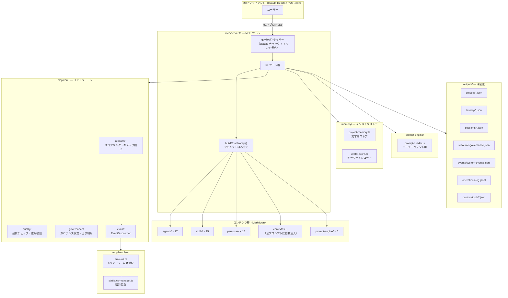
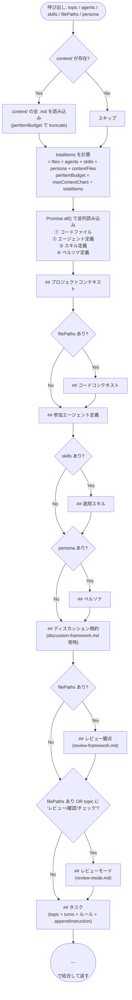
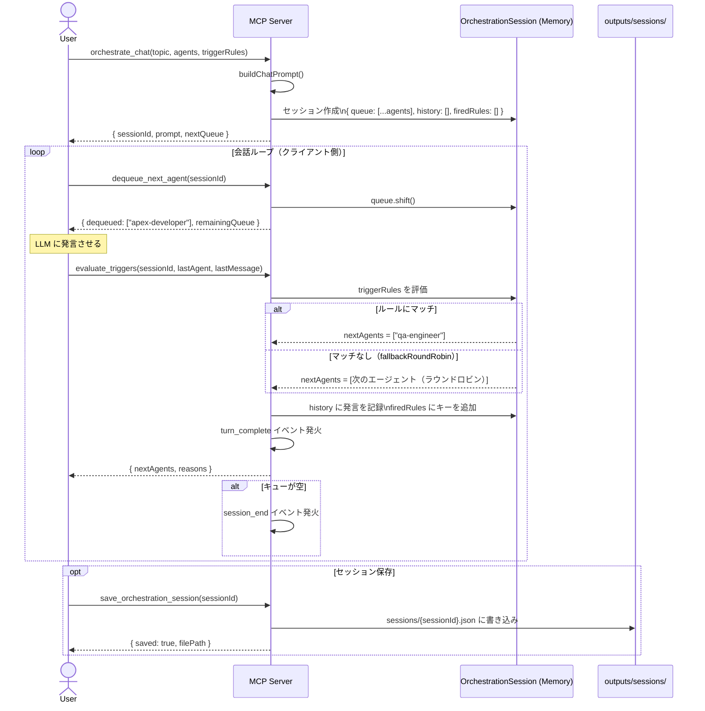
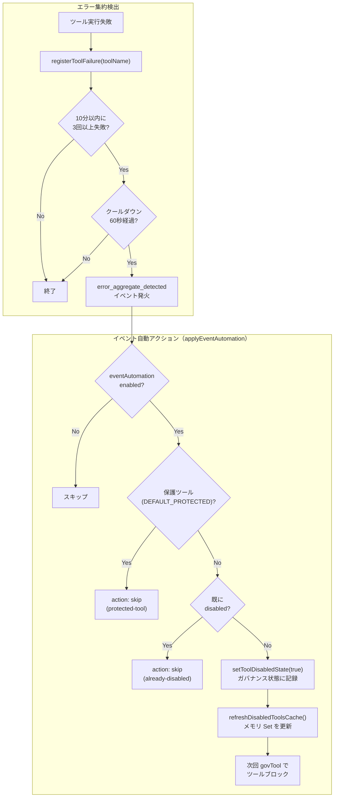
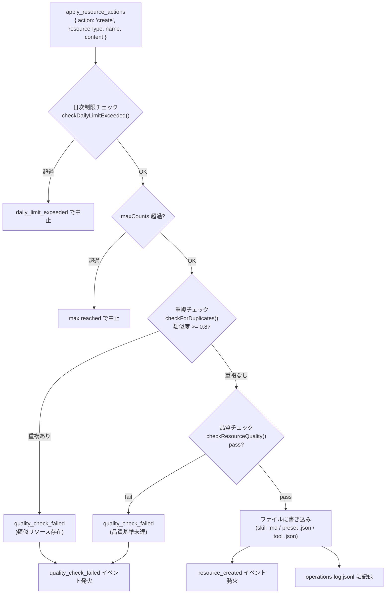
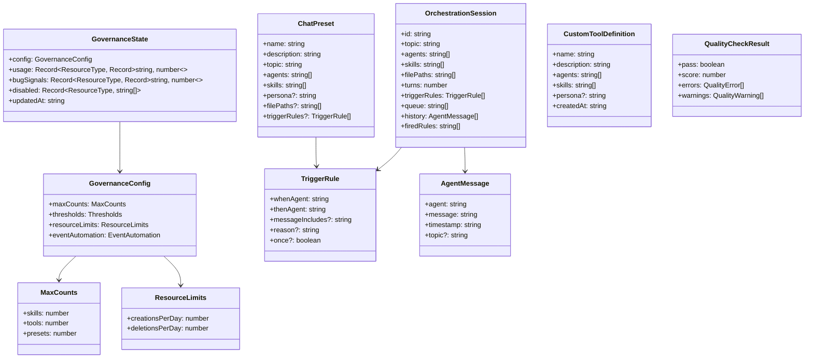
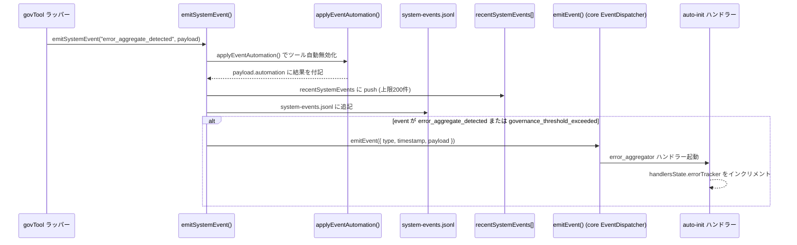

# salesforce-ai-company システム構成ドキュメント（UML付き）

> リポジトリ: `D:\Projects\mult-agent-ai\salesforce-ai-company`  
> 作成日: 2026-04-20

---

## 1. システム全体アーキテクチャ



---

## 2. プロンプト生成フロー（`buildChatPrompt`）



---

## 3. スキル自動選択フロー

```mermaid
flowchart TD
    CALL["chat() 呼び出し\nskills = 未指定"]
    CALL --> AUTO["suggestSkillsFromTopic(topic, 3)"]
    AUTO --> LIST["listMdFiles('skills')\n全スキルの name + summary を取得"]
    LIST --> SCORE["scoreByQuery(topic, name, summary)\nJaccard + usage + bugSignals でスコア計算"]
    SCORE --> RANK["スコア降順ソート\n上位3件を選択"]
    RANK --> CHECK{overallMax\n>= 閾値(6)?}
    CHECK -- No --> EVT["low_relevance_detected\nイベント発火"]
    CHECK -- Yes --> DISABLED["filterDisabledSkills()\n disabled スキルを除外"]
    EVT --> DISABLED
    DISABLED --> PROMPT["buildChatPrompt() に渡す"]
```

---

## 4. オーケストレーションシーケンス図



---

## 5. ガバナンス・イベント自動化フロー



---

## 6. リソース作成フロー（`apply_resource_actions` の create）



---

## 7. クラス関係図（主要インターフェース）



---

## 8. イベントシステムのシーケンス（ブリッジ構造）



---

## 9. ファイル構成図

```
salesforce-ai-company/
├── mcp/
│   ├── server.ts                    ← 全ツール登録・buildChatPrompt・ガバナンス管理
│   ├── tools/
│   │   ├── apex-analyzer.ts         ← 9項目静的チェック
│   │   ├── lwc-analyzer.ts          ← 7項目静的チェック
│   │   ├── deploy-org.ts            ← sf CLI コマンド生成
│   │   ├── run-tests.ts             ← Apex テストコマンド生成
│   │   ├── branch-diff-summary.ts   ← git diff 集計
│   │   ├── branch-diff-to-prompt.ts ← diff → プロンプト変換
│   │   ├── pr-readiness-check.ts    ← PR 準備スコア
│   │   ├── security-delta-scan.ts   ← セキュリティ差分検出
│   │   ├── deployment-impact-summary.ts
│   │   └── changed-tests-suggest.ts
│   ├── core/
│   │   ├── resource/
│   │   │   ├── resource-selector.ts     ← scoreCandidate() スコアリング
│   │   │   ├── resource-gap-detector.ts ← ギャップ検出
│   │   │   └── resource-suggester.ts    ← リソース提案
│   │   ├── quality/
│   │   │   ├── quality-checker.ts   ← スキル/ツール/プリセット品質チェック
│   │   │   └── deduplication.ts     ← Jaccard 類似度重複検出
│   │   ├── governance/
│   │   │   └── governance-manager.ts ← GovernanceConfig・日次制限・スコア計算
│   │   └── event/
│   │       └── event-dispatcher.ts  ← EventDispatcher (onEvent / emitEvent)
│   └── handlers/
│       ├── auto-init.ts             ← 6ハンドラー自動登録・HandlersState
│       └── statistics-manager.ts   ← CSV/JSON エクスポート
├── memory/
│   ├── project-memory.ts            ← memory[] 配列 (add/search/list/clear)
│   └── vector-store.ts             ← records[] 配列 (addRecord/searchByKeyword)
├── prompt-engine/
│   ├── prompt-builder.ts           ← buildPrompt(agent, task)
│   ├── base-prompt.md
│   ├── reasoning-framework.md
│   ├── discussion-framework.md
│   ├── review-framework.md
│   └── review-mode.md
├── agents/       (17 .md)
├── skills/       (25 .md)
├── personas/     (15 .md)
├── context/      (3 .md ← 全プロンプトに自動注入)
├── outputs/
│   ├── presets/          (7 .json)
│   ├── history/          (.json 都度生成)
│   ├── sessions/         (.json 都度生成)
│   ├── custom-tools/     (.json 動的生成)
│   ├── resource-governance.json
│   ├── system-events.jsonl
│   └── operations-log.jsonl
└── tests/
    ├── server-tools.integration.test.ts  ← ツール登録確認 + E2E
    ├── core-tools.test.ts
    ├── advanced-tools.test.ts
    ├── branch-diff-tools.test.ts
    ├── apply-resource-actions.test.ts
    ├── core-modules.test.ts
    ├── handlers-modules.test.ts
    └── memory-prompt.test.ts
```

---

## 10. ツール分類一覧（55ツール）

### 静的解析・コマンド生成（11）

| ツール名 | 概要 |
|---|---|
| `repo_analyze` | Apex/LWC/Object のファイル一覧を返す |
| `apex_analyze` | Apex 9項目静的チェック（SOQL in loop / DML in loop / without sharing 等） |
| `lwc_analyze` | LWC 7項目静的チェック（@wire / @api / imperative / NavigationMixin 等） |
| `deploy_org` | `sf project deploy start` コマンドを組み立てて返す |
| `run_tests` | `sf apex run test` コマンドを組み立てて返す |
| `branch_diff_summary` | ブランチ差分のファイル変更サマリー |
| `branch_diff_to_prompt` | ブランチ差分からレビュー用プロンプトを生成 |
| `pr_readiness_check` | PR 準備スコアと ready/needs-review/blocked ゲート |
| `security_delta_scan` | 差分から CRUD/FLS/sharing/動的 SOQL 懸念を検出 |
| `deployment_impact_summary` | 差分をメタデータ種別に集計してデプロイ注意点を返す |
| `changed_tests_suggest` | 差分から推奨テストクラスと実行コマンドを返す |

### 定義参照（5）

| ツール名 | 概要 |
|---|---|
| `list_agents` | 全エージェント一覧（name + summary） |
| `get_agent` | 特定エージェントの Markdown 全文 |
| `list_skills` | 全スキル一覧（name + summary） |
| `get_skill` | 特定スキルの Markdown 全文 |
| `list_personas` | 全ペルソナ一覧（name + summary） |

### 会話生成（6）

| ツール名 | 概要 |
|---|---|
| `chat` | マルチエージェントプロンプト生成（メイン） |
| `simulate_chat` | `chat` の互換エイリアス |
| `smart_chat` | リポジトリ自動分析 + ファイル自動選択して `chat` 実行 |
| `batch_chat` | 複数トピック一括処理（topicConfigs / parallel 対応） |
| `build_prompt` | 単一エージェント用軽量プロンプト（base + reasoning のみ） |
| `get_context` | context/ の内容確認（プロンプトに何が注入されているか） |

### オーケストレーション（7）

| ツール名 | 概要 |
|---|---|
| `orchestrate_chat` | triggerRules 付きセッション開始 |
| `evaluate_triggers` | 発言に対してルール評価し次エージェントを返す |
| `dequeue_next_agent` | キューから次エージェントを取り出す |
| `get_orchestration_session` | セッション状態確認 |
| `save_orchestration_session` | セッションをファイルに保存 |
| `restore_orchestration_session` | 保存済みセッションを復元 |
| `list_orchestration_sessions` | 保存済みセッション一覧 |

### ログ・履歴（7）

| ツール名 | 概要 |
|---|---|
| `record_agent_message` | エージェントメッセージを手動記録 |
| `get_agent_log` | ログ取得（エージェント名・件数フィルタ） |
| `parse_and_record_chat` | `**agent**: message` 形式を解析してログに記録 |
| `save_chat_history` | 現在のログを JSON 保存 |
| `load_chat_history` | 保存済み履歴一覧 |
| `restore_chat_history` | 保存済み履歴をログに復元 |
| `export_to_markdown` | チャット履歴を Markdown エクスポート（ファイル出力可） |

### プリセット・検索（5）

| ツール名 | 概要 |
|---|---|
| `create_preset` | プリセット作成（triggerRules 対応） |
| `list_presets` | プリセット一覧 |
| `run_preset` | プリセット実行（overrideAgents / additionalSkills 対応） |
| `search_resources` | スキル/ツール/プリセット横断検索（スコア付き） |
| `auto_select_resources` | トピックから最適リソースを自動選択 |

### 分析・統計（4）

| ツール名 | 概要 |
|---|---|
| `analyze_chat_trends` | ログ傾向分析（historyId / since / groupBy） |
| `get_handlers_dashboard` | ハンドラー稼働統計 |
| `export_handlers_statistics` | ハンドラー統計を JSON/CSV エクスポート |
| `get_system_events` | システムイベントログ取得 |

### イベント自動化設定（2）

| ツール名 | 概要 |
|---|---|
| `get_event_automation_config` | イベント自動アクション設定を返す |
| `update_event_automation_config` | イベント自動アクション設定を更新 |

### ガバナンス（4）

| ツール名 | 概要 |
|---|---|
| `get_resource_governance` | ガバナンス状態（カウント/usage/bugSignals/disabled） |
| `record_resource_signal` | usage と bugSignal を記録 |
| `review_resource_governance` | 整理推奨リストを返す（設定変更も可） |
| `apply_resource_actions` | スキル/ツール/プリセットの作成/削除/無効化/有効化 |

### メモリ・ベクターストア（6）

| ツール名 | 概要 |
|---|---|
| `add_memory` | テキストをインメモリ記録 |
| `search_memory` | 部分一致検索 |
| `list_memory` | 全記録を返す |
| `clear_memory` | 全削除 |
| `add_vector_record` | id/text/tags でレコード追加 |
| `search_vector` | キーワード検索 |


## 11. スコアリングロジック

```
score = nameMatch + tagMatch + descriptionMatch + usageBonus - bugPenalty + recencyBonus

nameMatch:   完全一致 +30 / 含む +12 / トークン部分一致 +4/件
tagMatch:    +8/マッチタグ
descMatch:   含む +6 / トークン部分一致 +3/件
usageBonus:  log(usage + 1) × 0.5
bugPenalty:  bugSignals × 3
recBonus:    7日以内の更新で最大 +5

低関連度閾値: 6（未満で low_relevance_detected イベント発火）
```

---

## 12. データ永続化マップ

| データ | 形式 | パス | 揮発性 |
|---|---|---|---|
| チャット履歴 | JSON | `outputs/history/{id}.json` | 永続 |
| オーケストレーションセッション（保存済み） | JSON | `outputs/sessions/{id}.json` | 永続 |
| システムイベントログ | JSONL | `outputs/events/system-events.jsonl` | 永続 |
| 操作ログ（日次制限用） | JSONL | `outputs/operations-log.jsonl` | 永続 |
| ガバナンス状態 | JSON | `outputs/resource-governance.json` | 永続 |
| カスタムツール定義 | JSON | `outputs/custom-tools/{name}.json` | 永続 |
| プリセット | JSON | `outputs/presets/{name}.json` | 永続 |
| エージェントログ（agentLog） | メモリ配列 | — | **揮発** |
| オーケストレーションセッション（Map） | メモリ Map | — | **揮発**（save で永続化可） |
| インメモリ文字列ストア | メモリ配列 | — | **揮発** |
| ベクターストア | メモリ配列 | — | **揮発** |
| disabled ツールキャッシュ | メモリ Set | — | **揮発**（起動時/操作後に再構築） |
| システムイベント（直近200件） | メモリ配列 | — | **揮発**（上限超過で古い順削除） |
